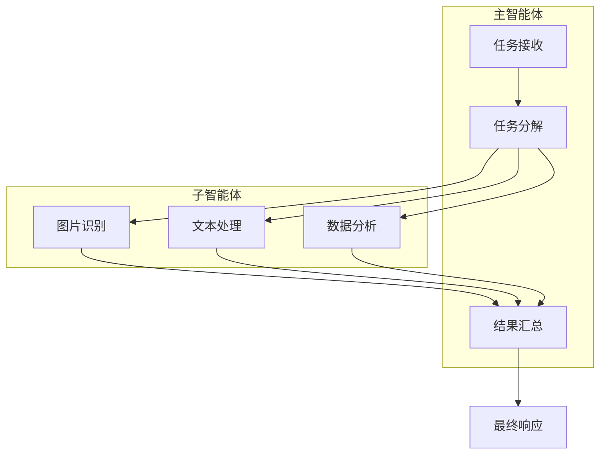
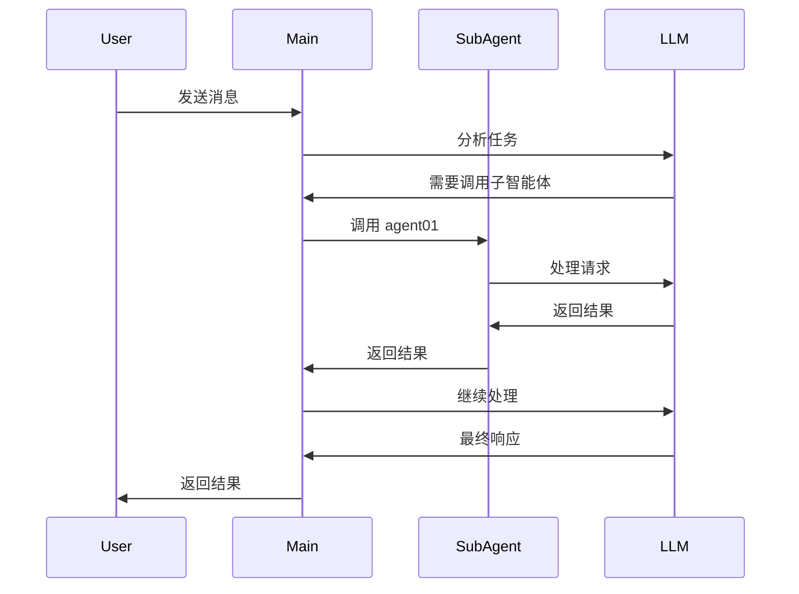

# 多智能体协作

TPCLAW 支持主智能体调用多个子智能体协作完成复杂任务。

## 协作模式



## 配置子智能体

### 定义子智能体工具
```json
{
  "tools": [
    {
      "type": "agent",
      "name": "图片识别",
      "targetId": "agent01",
      "description": "图片识别和理解专家"
    },
    {
      "type": "agent",
      "name": "客服",
      "targetId": "agent02",
      "description": "客服支持"
    }
  ]
}
```

### 子智能体配置文件
```
data/agents/
├── main.json      # 主智能体
├── agent01.json   # 图片识别智能体
├── agent02.json   # 客服智能体
└── agent03.json   # 销售智能体
```

## 调用流程


## 相关文档
- [子智能体](/guide/advanced/sub-agent) - 子智能体调用方式详解
- [统一智能体设计](/guide/advanced/unified-agent) - 智能体设计模式
- [智能体配置](/guide/core-features/agents) - 智能体详细配置
