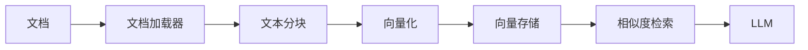

# 向量检索 RAG

配置向量检索增强生成能力。

## RAG 架构


## 组件配置
### Embedding 配置
```yaml
embedding:
  provider: openai
  model: text-embedding-3-small
```
### 向量存储配置
```yaml
vectorstore:
  type: redis
  redis:
    addr: localhost:6379
```
## 规则链配置
```json
{
  "nodes": [
    {
      "type": "ai/embedding/openai",
      "configuration": {
        "model": "text-embedding-3-small"
      }
    },
    {
      "type": "ai/indexer/redis",
      "configuration": {
        "indexName": "documents"
      }
    },
    {
      "type": "ai/retriever/redis",
      "configuration": {
        "topK": 5
      }
    }
  ]
}
```
## 相关文档
- [核心功能 - 记忆](/guide/core-features/memory) - 记忆系统
