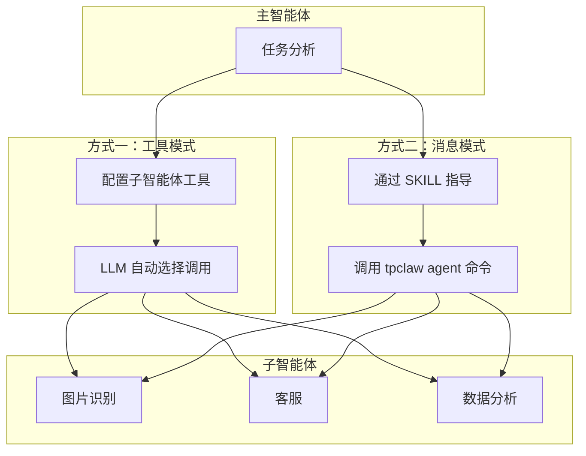
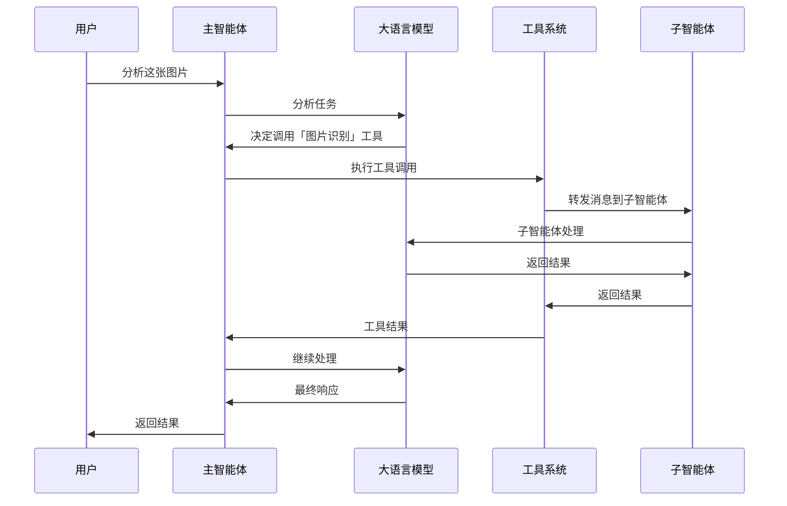
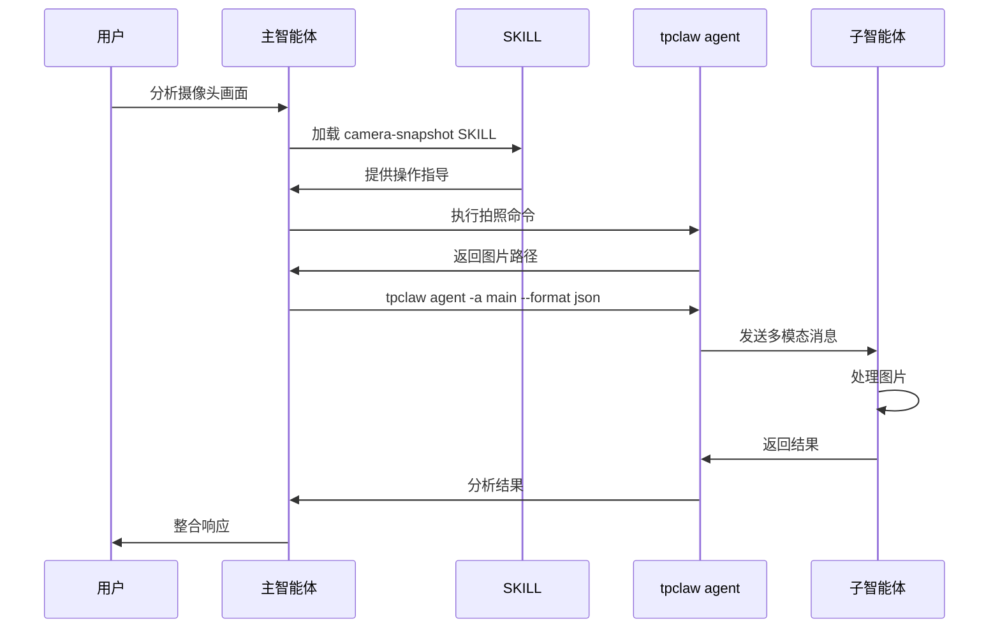
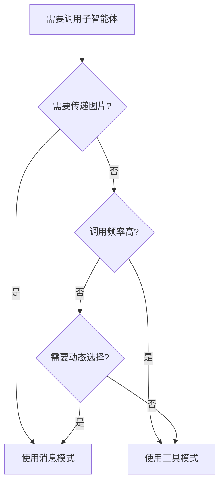

# 子智能体

子智能体是专业化、可复用的智能体单元，主智能体可以通过多种方式调用子智能体来协作完成复杂任务。

## 概述

TPCLAW 提供两种子智能体调用方式：

| 方式 | 适用场景 | 特点 |
|------|----------|------|
| **工具模式** | 固定协作、高频调用 | 配置简单、自动路由、透明调用 |
| **消息模式** | 灵活协作、按需调用 | 动态指定、支持多模态、可传上下文 |



## 方式一：工具模式

将子智能体配置为工具，主智能体可以像调用普通工具一样调用子智能体。

### 工作原理



### 配置步骤

#### 1. 创建子智能体配置

在 `data/agents/` 目录下创建子智能体配置文件：

```json
// data/agents/agent01.json
{
  "ruleChain": {
    "id": "agent01",
    "name": "图片识别",
    "additionalInfo": {
      "description": "图片识别和理解专家",
      "icon": "🖼️"
    }
  },
  "metadata": {
    "firstNodeIndex": 0,
    "nodes": [
      {
        "id": "node_agent01",
        "type": "ai/agent",
        "name": "图片识别",
        "configuration": {
          "model": "gpt-4o",
          "systemPrompt": "你是一个专业的图片识别专家...",
          "tools": []
        }
      }
    ]
  }
}
```

#### 2. 在主智能体中配置子智能体工具

在主智能体配置的 `tools` 数组中添加子智能体：

```json
// data/agents/main.json
{
  "ruleChain": {
    "id": "main",
    "name": "TeamClaw"
  },
  "metadata": {
    "nodes": [
      {
        "id": "node_main",
        "type": "ai/agent",
        "configuration": {
          "model": "gpt-4",
          "systemPrompt": "你是主智能体...",
          "tools": [
            {
              "type": "agent",
              "name": "图片识别",
              "targetId": "agent01",
              "description": "图片识别和理解专家，用于分析图片内容"
            },
            {
              "type": "agent",
              "name": "客服",
              "targetId": "agent02",
              "description": "客服支持，处理用户咨询"
            },
            {
              "type": "agent",
              "name": "销售",
              "targetId": "agent03",
              "description": "销售助手，处理销售相关问题"
            }
          ]
        }
      }
    ]
  }
}
```

### 配置参数

| 参数 | 类型 | 必填 | 说明 |
|------|------|------|------|
| `type` | string | 是 | 固定值 `agent`，表示子智能体类型 |
| `name` | string | 是 | 工具名称，用于 LLM 识别 |
| `targetId` | string | 是 | 目标子智能体 ID，对应配置文件名 |
| `description` | string | 是 | 工具描述，LLM 根据此描述决定是否调用 |
| `config` | object | 否 | 额外配置参数 |

### 调用流程

1. **用户发送请求** → 主智能体接收消息
2. **LLM 分析** → 根据工具描述决定是否调用子智能体
3. **工具执行** → 工具系统将消息转发给子智能体
4. **子智能体处理** → 子智能体独立处理请求
5. **返回结果** → 子智能体结果作为工具返回值
6. **主智能体整合** → 主智能体整合结果并响应

### 实现原理

工具模式底层通过 `RuleGoTool` 实现：

```go
// rulego-components-ai/ai/agent/tool_rulego.go

func (t *RuleGoTool) InvokableRun(ctx context.Context, argumentsInJSON string, opts ...tool.Option) (string, error) {
    switch t.Config.Type {
    case config.ToolTypeAgent:
        // agent 类型调用子智能体
        return t.executeRuleChain(ctx, ruleCtx, argumentsInJSON)
    }
}

func (t *RuleGoTool) executeRuleChain(ctx context.Context, ruleCtx types.RuleContext, arguments string) (string, error) {
    // 创建消息并转发到子智能体
    toolMsg := ruleCtx.NewMsg(config.MsgTypeToolCall, types.NewMetadata(), arguments)
    
    // 调用子智能体规则链
    ruleCtx.TellFlow(t.Config.TargetId, toolMsg, ...)
}
```

### 优点

- **配置简单** - 只需在 tools 数组中添加配置
- **自动路由** - LLM 根据描述自动选择合适的子智能体
- **透明调用** - 对用户完全透明，无需额外操作
- **统一管理** - 所有工具统一配置

### 限制

- **固定配置** - 子智能体在配置时确定，运行时无法动态更改
- **单向通信** - 主智能体调用子智能体，子智能体不能主动回调
- **无多模态** - 不支持直接传递图片等非文本内容

## 方式二：消息模式

通过 SKILL 指导主智能体使用 `tpclaw agent` 命令向子智能体发送消息。

### 工作原理



### 使用场景

消息模式特别适合以下场景：

- **多模态任务** - 需要传递图片、文件等非文本内容
- **动态协作** - 运行时动态决定调用哪个子智能体
- **上下文传递** - 需要传递额外的上下文信息
- **跨智能体通信** - 子智能体之间需要通信

### 实现方式

#### 1. 创建 SKILL 文件

SKILL 文件指导主智能体如何调用子智能体：

```markdown
---
name: camera-snapshot
description: 摄像头拍照技能。用于控制 IPC 摄像头进行拍照。如果用户需要分析画面内容，则调用 tpclaw agent 进行分析后返回结果。
---

# 摄像头拍照技能

## 步骤一：执行拍照

\`\`\`bash
/usr/local/bin/ipc-control -c /etc/techphant/ipc.yaml snapshot
\`\`\`

## 步骤二：判断是否需要分析图片

### 情况 A：用户需要分析图片

调用 tpclaw agent 分析（**必须使用 `--format json` 参数**）：

\`\`\`bash
tpclaw agent -a main --format json -m '{"messages":[{"role":"user","content":[{"type":"text","text":"请分析这张图片"},{"type":"image_url","image_url":{"url":"/tmp/snapshot_xxx.jpg"}}]}]}'
\`\`\`

### 情况 B：用户不需要分析图片

拍照完成后直接回复用户。
```

#### 2. 主智能体加载 SKILL

主智能体通过 `skill` 工具加载 SKILL：

```bash
# 主智能体自动调用
skill camera-snapshot
```

#### 3. 执行 SKILL 指导的操作

主智能体根据 SKILL 指导执行相应操作。

### tpclaw agent 命令详解

#### 基本语法

```bash
tpclaw agent -m <message> -a <agent-id> [options]
```

#### 参数说明

| 参数 | 短参数 | 必须 | 默认值 | 说明 |
|------|--------|------|--------|------|
| `--message` | `-m` | 是 | - | 消息内容 |
| `--agent` | `-a` | 否 | `main` | 智能体 ID |
| `--format` | - | 否 | `text` | 输入格式：`text` 或 `json` |
| `--stream` | - | 否 | `false` | 流式输出 |
| `--history` | `-H` | 否 | `false` | 加载历史消息上下文 |

#### 多模态消息格式

使用 `--format json` 发送包含图片的消息：

```bash
tpclaw agent -a main --format json -m '{
  "messages": [{
    "role": "user",
    "content": [
      {"type": "text", "text": "请分析这张图片"},
      {"type": "image_url", "image_url": {"url": "/path/to/image.jpg"}}
    ]
  }]
}'
```

#### 图片格式支持

| 格式 | 示例 |
|------|------|
| 本地路径 | `/tmp/snapshot.jpg` |
| file:// URL | `file:///tmp/snapshot.jpg` |
| HTTP URL | `https://example.com/image.jpg` |
| Base64 | `data:image/png;base64,iVBORw0KGgo...` |

### 完整示例：图片识别

#### SKILL 文件

```markdown
---
name: agent-message
description: 智能体消息发送技能。用于向指定智能体发送消息并获取响应。支持多模态消息（文本、图片）、流式输出、历史消息加载。
---

# 智能体消息发送

## 命令格式

\`\`\`bash
tpclaw agent -m <message> -a <agent-id> [options]
\`\`\`

## 多模态消息

使用 `--format json` 发送包含图片的消息：

\`\`\`bash
tpclaw agent -a main --format json -m '{"messages":[{"role":"user","content":[{"type":"text","text":"分析这张图片"},{"type":"image_url","image_url":{"url":"/tmp/snapshot.jpg"}}]}]}'
\`\`\`
```

#### 主智能体调用流程

```bash
# 1. 拍照
SNAPSHOT_PATH=$(/usr/local/bin/ipc-control snapshot)

# 2. 调用子智能体分析图片
tpclaw agent -a main --format json -m '{"messages":[{"role":"user","content":[{"type":"text","text":"请分析这张图片"},{"type":"image_url","image_url":{"url":"'"$SNAPSHOT_PATH"'"}}]}]}'

# 3. 整合结果返回给用户
```

### 优点

- **多模态支持** - 支持传递图片、文件等非文本内容
- **动态灵活** - 运行时动态决定调用目标和参数
- **上下文控制** - 可选择是否加载历史上下文
- **跨智能体通信** - 任意智能体之间可以通信

### 限制

- **需要 SKILL 指导** - 需要编写 SKILL 文件指导主智能体
- **命令行调用** - 通过 bash 工具执行命令，有一定开销

## 两种方式对比

| 特性 | 工具模式 | 消息模式 |
|------|----------|----------|
| **配置复杂度** | 低（JSON 配置） | 中（需要 SKILL） |
| **多模态支持** | ❌ 不支持 | ✅ 支持 |
| **动态选择** | ❌ 固定配置 | ✅ 运行时决定 |
| **历史上下文** | ❌ 不支持 | ✅ 支持 |
| **调用开销** | 低（内存调用） | 中（命令行） |
| **适用场景** | 固定协作、高频调用 | 灵活协作、多模态任务 |

## 最佳实践

### 选择合适的方式



### 工具模式最佳实践

1. **清晰的描述** - 为子智能体提供清晰的描述，帮助 LLM 正确选择
2. **合理的分工** - 子智能体应该有明确的职责边界
3. **避免重复** - 不要配置功能重叠的子智能体

```json
{
  "type": "agent",
  "name": "图片识别",
  "targetId": "agent01",
  "description": "图片识别和理解专家。用于：1) 识别图片中的物体和场景 2) 分析图片内容 3) 提取图片中的文字。不适用于：音频处理、视频分析"
}
```

### 消息模式最佳实践

1. **明确的 SKILL 指导** - SKILL 文件应该清晰说明调用时机和方式
2. **错误处理** - 处理命令执行失败的情况
3. **资源清理** - 及时清理临时文件

```markdown
---
name: image-analysis
description: 图片分析技能。当需要分析图片时使用。
---

# 图片分析技能

## 步骤

1. 确认图片路径存在
2. 使用 tpclaw agent 发送多模态消息
3. 处理返回结果

## 错误处理

- 图片不存在：提示用户重新提供
- 命令执行失败：记录错误并重试
- 超时：提示用户稍后重试
```

## 相关文档

- [多智能体协作](/guide/advanced/multi-agent) - 多智能体架构设计
- [智能体配置](/guide/configuration/agents) - 智能体详细配置
- [SKILL 系统](/guide/tools/skill) - SKILL 编写指南
- [工具系统](/guide/tools/read) - 内置工具说明