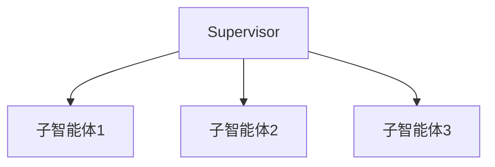

# 统一智能体设计

TPCLAW 提供统一的智能体设计框架，支持多种智能体模式。

## 智能体模式
| 模式 | 描述 | 使用场景 |
|------|------|----------|
| React | 简单工具调用 | 简单任务处理 |
| Supervisor | 多智能体协调 | 复杂任务分解 |
| Deep | 深度任务编排 | 长时间任务处理 |

## React 模式
基本的工具调用模式：
```json
{
  "type": "ai/agent",
  "configuration": {
    "mode": "react",
    "maxStep": 100,
    "tools": [...]
  }
}
```
## Supervisor 模式
中央协调模式：

## Deep 模式
支持任务分解和进度跟踪：
```json
{
  "type": "ai/agent",
  "configuration": {
    "mode": "deep",
    "maxStep": 200,
    "tools": [...]
  }
}
```
## 相关文档
- [多智能体协作](/guide/advanced/multi-agent) - 多智能体配置
