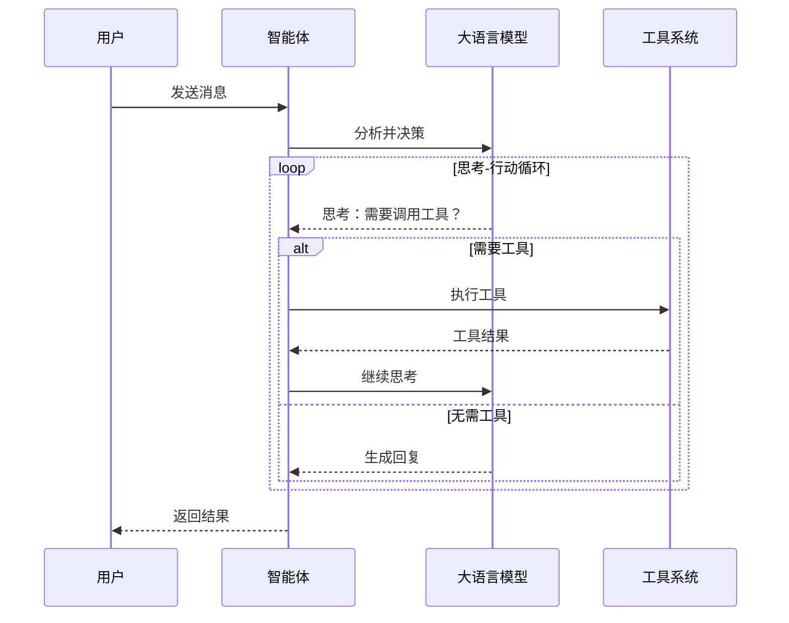
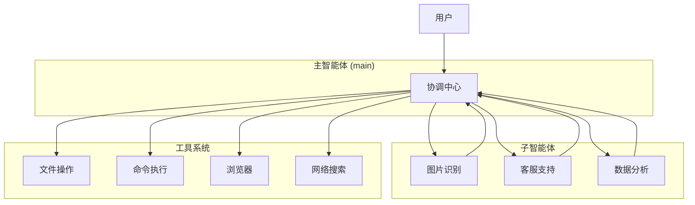

# 智能体

智能体（Agent）是 TPCLAW 的核心执行单元，基于 LLM 实现自主推理、工具调用和多轮对话能力。

## 概述

TPCLAW 的智能体具有以下核心能力：

- **自主推理** - 基于 ReAct 模式进行思考-行动循环
- **工具调用** - 支持内置工具、子智能体、规则链等多种工具类型
- **多轮对话** - 维护完整的对话上下文
- **流式输出** - 支持流式响应，实时展示生成过程
- **自我进化** - 通过工作空间文件持续学习和改进

## 工作原理

### ReAct 模式

智能体采用 ReAct（Reasoning + Acting）模式工作：



### 执行流程

1. **接收消息** - 从用户或通道接收消息
2. **加载上下文** - 加载会话历史、记忆、身份等
3. **思考决策** - LLM 分析并决定下一步行动
4. **执行工具** - 如需调用工具，执行并获取结果
5. **生成回复** - 生成最终回复或继续循环
6. **保存状态** - 保存会话、更新记忆

## 智能体类型

### 主智能体

主智能体是系统的核心，负责处理大部分用户请求：

- 处理用户对话
- 协调子智能体
- 管理工作空间
- 执行复杂任务

### 子智能体

子智能体是专业化的智能体，处理特定领域的任务：

| 子智能体 | 专长领域 |
|---------|---------|
| 图片识别 | 图像理解和分析 |
| 数据分析 | 数据处理和可视化 |
| 客服支持 | 用户咨询和问题解答 |
| 代码助手 | 编程和代码审查 |

## 工具系统

智能体可以调用多种类型的工具：

### 内置工具

| 工具 | 功能 |
|------|------|
| `read` | 读取文件内容 |
| `write` | 写入文件 |
| `edit` | 编辑文件 |
| `bash` | 执行 Shell 命令 |
| `skill` | 调用技能脚本 |
| `browser_use` | 浏览器自动化 |
| `search` | 网络搜索 |

### 子智能体工具

主智能体可以将子智能体作为工具调用：

```
用户：帮我分析这张图片
主智能体：调用「图片识别」子智能体
子智能体：分析图片并返回结果
主智能体：整合结果回复用户
```

### 规则链工具

调用预定义的规则链处理特定任务。

## 多智能体协作

### 架构图



### 协作模式

| 模式 | 说明 | 示例 |
|------|------|------|
| 路由模式 | 根据任务类型路由到专业子智能体 | 图片问题 → 图片识别智能体 |
| 管道模式 | 多个智能体按顺序处理 | 数据获取 → 分析 → 报告生成 |
| 并行模式 | 多个智能体并行处理 | 同时查询多个数据源 |

## 工作空间

每个智能体都有独立的工作空间，包含：

| 文件 | 作用 |
|------|------|
| `IDENTITY.md` | 身份定义（名称、本质、风格） |
| `AGENTS.md` | 工作流程和行为准则 |
| `SOUL.md` | 核心价值观 |
| `TOOLS.md` | 工具使用说明 |
| `USER.md` | 用户画像 |
| `MEMORY.md` | 长期记忆 |
| `BOOTSTRAP.md` | 首次启动引导 |

详见 [工作空间结构](/guide/workspace/structure)。

## 心跳机制

智能体支持心跳任务，定期主动执行操作：

- 检查待办事项
- 发送定时提醒
- 执行后台任务
- 更新状态信息

### 心跳配置

```yaml
agents:
  defaults:
    heartbeat:
      interval: "30m"        # 心跳间隔
      active_hours:          # 激活时间段
        start: "09:00"
        end: "22:00"
```

## 会话管理

智能体支持多种会话模式：

| 作用域 | 说明 |
|--------|------|
| `per_peer` | 按用户隔离，每个用户独立会话 |
| `per_channel` | 按群组隔离，群内共享会话 |
| `global` | 全局共享，所有用户同一会话 |

详见 [会话管理](/guide/core-features/sessions)。

## 记忆系统

智能体具有多层记忆：

| 记忆类型 | 存储 | 说明 |
|---------|------|------|
| 短期记忆 | 会话历史 | 当前对话上下文 |
| 工作记忆 | 工作空间文件 | 身份、规则、用户信息 |
| 长期记忆 | MEMORY.md | 经过整理的重要信息 |
| 每日笔记 | memory/YYYY-MM-DD.md | 当日发生的事情 |

详见 [记忆系统](/guide/core-features/memory)。

## 使用智能体

### 通过 API

```bash
curl -X POST http://localhost:9527/api/v1/chat/completions \
  -H "Content-Type: application/json" \
  -d '{
    "model": "main",
    "messages": [{"role": "user", "content": "你好"}]
  }'
```

### 通过 CLI

```bash
# 快速提问
tpclaw agent -m "今天天气怎么样？"

# 交互式对话
tpclaw agent chat

# 指定智能体
tpclaw agent -a agent01 -m "分析这张图片"
```

### 通过 IM 通道

在飞书、钉钉等 IM 平台直接与智能体对话。

## 相关文档

- [智能体配置](/guide/configuration/agents) - 详细配置说明
- [工具系统](/guide/tools/read) - 工具详细说明
- [会话管理](/guide/core-features/sessions) - 会话历史管理
- [记忆系统](/guide/core-features/memory) - 记忆加载机制
- [工作空间](/guide/workspace/structure) - 工作空间结构
- [多智能体协作](/guide/advanced/multi-agent) - 多智能体设计
- [REST API](/guide/api/rest-api) - API 参考