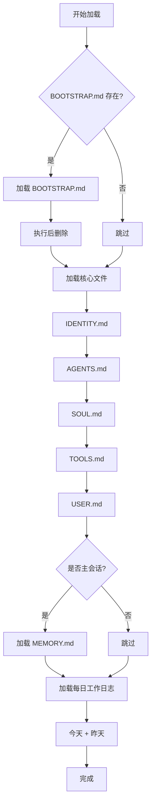
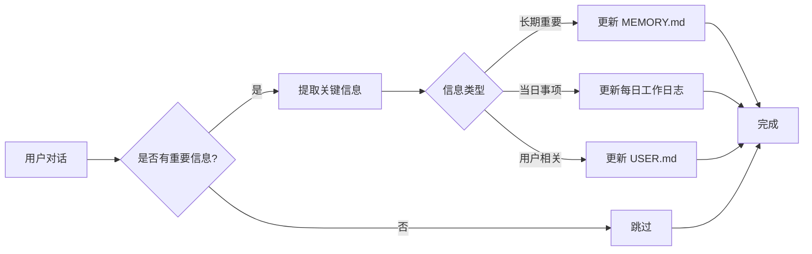

# 记忆系统

记忆系统是智能体的长期知识存储机制，通过工作空间中的 Markdown 文件管理智能体的记忆、知识和行为规则。

## 概述

TPCLAW 的记忆系统具有以下特点：

- **文件化存储** - 记忆以 Markdown 文件形式存储，易于查看和编辑
- **分层加载** - 根据会话类型和场景加载不同层级的记忆
- **自动时效** - 支持按日期加载每日工作日志，自动过期旧记忆
- **心跳任务** - 支持定时任务和主动联系用户

## 记忆文件结构

```
workspace/
├── BOOTSTRAP.md          # 初始化配置（执行后自动删除）
├── MEMORY.md             # 长期记忆（仅主会话加载）
├── IDENTITY.md           # 身份定义
├── AGENTS.md             # 工作规则和记忆加载规则
├── SOUL.md               # 性格和价值观
├── TOOLS.md              # 工具使用笔记
├── USER.md               # 用户信息
├── HEARTBEAT.md          # 心跳任务清单
└── memory/
    ├── 2024-01-15.md     # 每日工作日志
    ├── 2024-01-14.md
    └── heartbeat-state.json  # 心跳状态
```

## 记忆加载规则

### 加载优先级

记忆文件按以下优先级加载到系统提示词：



### 每次会话必读

无论什么场景，以下文件都会被加载：

| 文件 | 用途 | 内容示例 |
|------|------|----------|
| `IDENTITY.md` | 身份定义 | 名字、角色、能力范围 |
| `AGENTS.md` | 工作规则 | 记忆加载规则、行为准则 |
| `SOUL.md` | 性格价值观 | 说话风格、价值取向 |
| `TOOLS.md` | 工具笔记 | 工具使用心得、最佳实践 |
| `USER.md` | 用户信息 | 用户偏好、重要关系 |

### 主会话额外加载

仅在主会话（与主人直接对话）时额外加载：

| 文件 | 用途 | 说明 |
|------|------|------|
| `MEMORY.md` | 长期记忆 | 精华记忆，需要长期保留的重要信息 |

### 每日工作日志加载

自动加载今天和昨天的每日工作日志：

```
memory/2024-01-15.md  # 今天
memory/2024-01-14.md  # 昨天
```

## 记忆文件详解

### MEMORY.md - 长期记忆

存储需要长期保留的精华记忆：

```markdown
# 长期记忆

## 关于主人
- 主人叫小明，是一名软件工程师
- 主人喜欢简洁的回答，不喜欢冗长的解释
- 主人的时区是 UTC+8

## 重要事件
- 2024-01-10: 主人提到要准备一个重要的演示
- 2024-01-12: 帮主人完成了项目文档的初稿

## 待办事项
- [ ] 周五提醒主人参加会议
- [ ] 整理主人的读书笔记
```

### AGENTS.md - 工作规则

定义智能体的工作方式和记忆加载规则：

```markdown
# 工作规则

## 记忆加载规则

每次会话，你都要先阅读以下文件，获取完整上下文：

### 必读文件（每次会话）
1. **SOUL.md** - 你的性格和价值观
2. **USER.md** - 关于主人的信息

### 每日工作日志（自动加载）
- memory/YYYY-MM-DD.md - 今天和昨天的日志

### 主会话额外加载
- **MEMORY.md** - 长期记忆（仅在与主人直接聊天时加载）

## 工作流程
1. 接收用户消息
2. 分析意图和上下文
3. 决定是否需要使用工具
4. 生成回复
5. 如有重要信息，更新记忆文件
```

### memory/YYYY-MM-DD.md - 每日工作日志

记录当天发生的重要事项：

```markdown
# 2024-01-15

## 今日事项
- 上午帮主人调试了一个 Python 脚本
- 下午讨论了新项目的技术方案
- 主人提到明天有个重要会议

## 明日计划
- 提醒主人参加会议
- 继续跟进项目文档

## 随手记
- 主人今天心情不错，说项目进展顺利
```

### USER.md - 用户信息

记录用户的相关信息：

```markdown
# 用户信息

## 基本信息
- 名称：小明
- 职业：软件工程师
- 时区：UTC+8（北京时间）

## 偏好
- 喜欢简洁直接的回答
- 偏好中文交流
- 对新技术很感兴趣

## 重要关系
- 有一个正在上学的弟弟
- 和同事小李合作密切

## 注意事项
- 不喜欢被打扰工作时间
- 周末通常不处理工作事务
```

## 心跳机制

心跳机制允许智能体在特定条件下主动联系用户。

### HEARTBEAT.md - 心跳任务清单

定义心跳触发时需要检查的任务：

```markdown
# 心跳任务清单

每 30 分钟检查一次以下事项：

## 邮件检查
- 检查是否有新邮件
- 如有重要邮件，主动告知主人

## 日历检查
- 检查即将到来的日程
- 提前 2 小时提醒主人

## 提及检查
- 检查是否有 @我的消息需要处理

## 天气检查
- 早上 8 点检查当天天气
- 如有恶劣天气，提醒主人
```

### 心跳状态文件

`memory/heartbeat-state.json` 跟踪心跳状态：

```json
{
  "lastCheckTime": "2024-01-15T10:30:00Z",
  "lastEmailCheck": "2024-01-15T10:00:00Z",
  "lastCalendarCheck": "2024-01-15T10:30:00Z",
  "lastWeatherCheck": "2024-01-15T08:00:00Z",
  "notifiedEvents": ["event_001", "event_002"]
}
```

### 心跳配置

```yaml
agents:
  defaults:
    heartbeat:
      interval: "30m"           # 心跳间隔
      active_hours:             # 激活时间段
        start: "09:00"
        end: "22:00"
      target: ""                # 目标通道
      load_history: false       # 是否加载历史
```

### 主动联系条件

心跳检查时，以下条件会触发主动联系：

| 条件 | 说明 |
|------|------|
| 重要邮件 | 收件箱有标记为重要的新邮件 |
| 日程提醒 | 日历事件即将开始（< 2 小时） |
| 长时间未联系 | 超过 8 小时没有与用户互动 |

## 记忆更新流程



### 记忆更新最佳实践

1. **及时更新** - 发现重要信息立即更新相应文件
2. **分类存储** - 根据信息类型选择正确的存储位置
3. **定期整理** - 定期清理过时的每日工作日志，提取精华到 MEMORY.md
4. **避免冗余** - 不要在多个文件中重复相同信息

## 系统提示词构建

智能体的系统提示词通过组合多个记忆文件构建：

```json
{
  "systemPrompt": "${fileExists(global.root_dir+'/workspace/BOOTSTRAP.md') ? include(global.root_dir+'/workspace/BOOTSTRAP.md') + '\\n\\n---\\n\\n' : ''}${include(global.root_dir+'/workspace/IDENTITY.md')}\n\n---\n\n${include(global.root_dir+'/workspace/AGENTS.md')}\n\n---\n\n${include(global.root_dir+'/workspace/SOUL.md')}\n\n---\n\n${include(global.root_dir+'/workspace/TOOLS.md')}\n\n---\n\n${include(global.root_dir+'/workspace/USER.md')}\n\n---\n\n## 你的ID\n\n${ruleChain.id}\n\n## 当前时间\n\n${now()}"
}
```

### 模板函数

| 函数 | 说明 | 示例 |
|------|------|------|
| `${include(path)}` | 包含文件内容 | `${include('workspace/SOUL.md')}` |
| `${fileExists(path)}` | 判断文件是否存在 | `${fileExists('workspace/BOOTSTRAP.md')}` |
| `${now()}` | 当前时间 | `2024-01-15 10:30:00` |
| `${global.xxx}` | 全局配置变量 | `${global.root_dir}` |

## 最佳实践

### 1. 分层记忆管理

```
长期记忆 (MEMORY.md)
    └── 精华信息，永不删除
中期记忆 (每日工作日志)
    └── 近期事项，自动过期
短期记忆 (会话上下文)
    └── 当前对话，自动压缩
```

### 2. 记忆文件命名规范

- 使用清晰的标题结构
- 使用 Markdown 格式
- 添加时间戳标记重要事件

### 3. 定期维护

- 每周整理每日工作日志，提取重要信息到 MEMORY.md
- 删除过期的每日工作日志（保留最近 7 天）
- 更新 USER.md 中的用户偏好

### 4. 心跳任务优化

- 合理设置心跳间隔（建议 30 分钟）
- 配置激活时间段，避免夜间打扰
- 只订阅必要的检查项

## 相关文档

- [工作空间结构](/guide/workspace/structure) - 工作空间目录说明
- [MEMORY.md](/guide/workspace/memory-md) - 长期记忆配置
- [AGENTS.md](/guide/workspace/agents-workspace) - 工作规则配置
- [会话管理](/guide/core-features/sessions) - 会话历史管理
