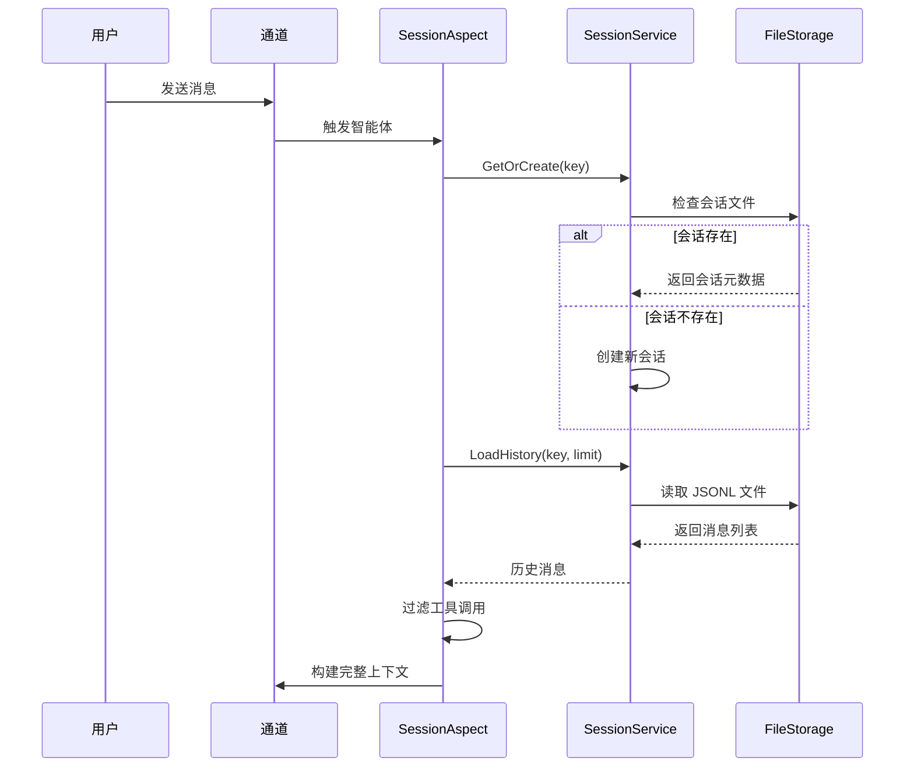
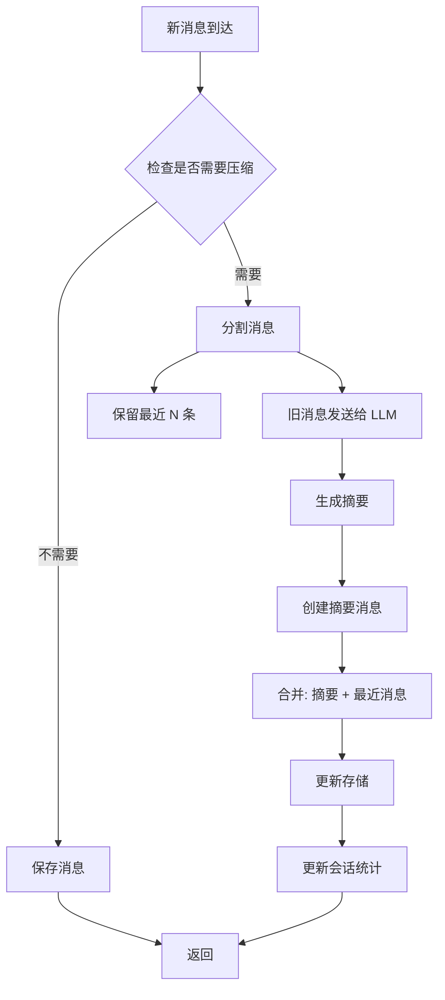

# 会话管理

会话管理模块负责维护智能体与用户之间的对话上下文，支持会话隔离、历史加载和智能压缩。

## 概述

TPCLAW 的会话系统具有以下核心能力：

- **多维度隔离** - 按智能体、通道、用户、群组等维度隔离会话
- **历史持久化** - 将对话历史保存为 JSONL 文件，支持重启后恢复
- **智能压缩** - 当上下文过长时自动压缩旧消息，保留关键信息
- **工具调用管理** - 智能过滤和保留工具调用消息

## 会话作用域

会话通过 **复合键** 实现隔离，支持以下作用域类型：

| 作用域 | 常量值 | 说明 | 典型场景 |
|--------|--------|------|----------|
| `main` | `ScopeMain` | 主会话，全局唯一 | 系统级对话 |
| `per_peer` | `ScopePerPeer` | 按用户隔离 | 私聊场景 |
| `per_channel_peer` | `ScopePerChannelPeer` | 按渠道+用户隔离 | 跨平台用户识别 |
| `per_account_channel` | `ScopePerAccountChannelPeer` | 按账号+渠道+用户隔离 | 多账号场景 |
| `thread` | `ScopeThread` | 按话题/线程隔离 | 论坛/帖子回复 |
| `task` | `ScopeTask` | 按任务隔离 | 独立任务执行 |

### 会话键格式

会话通过复合键唯一标识：

```
agent:{agentId}:channel:{channel}:scope:{scopeType}:{scopeId}
```

示例：
```
agent:main:channel:discord:scope:per_peer:user12345
agent:assistant:channel:feishu:scope:per_channel_peer:oc_xxx_user123
```

### 文件存储路径

会话数据以 JSONL 格式存储：

```
{baseDir}/{agentId}/{channel}/{scope}_{scopeId}.jsonl
```

## 会话配置

### 配置结构

```yaml
agents:
  defaults:
    session:
      enabled: true
      storage_path: "sessions"     # 存储目录
      max_messages: 200            # 最大消息数量
      max_token_count: 128000      # 最大 Token 数
      default_scope: "per_peer"    # 默认作用域
      ttl: "24h"                   # 会话存活时间
      idle_timeout: "30m"          # 空闲超时时间
```

### 配置项说明

| 配置项 | 类型 | 默认值 | 说明 |
|--------|------|--------|------|
| `enabled` | bool | `true` | 是否启用会话管理 |
| `storage_path` | string | `sessions` | 会话存储目录 |
| `max_messages` | int | `200` | 单个会话最大消息数 |
| `max_token_count` | int | `128000` | 单个会话最大 Token 数 |
| `default_scope` | string | `per_peer` | 默认会话作用域 |
| `ttl` | duration | `24h` | 会话存活时间 |
| `idle_timeout` | duration | `30m` | 空闲超时（超时后可清理） |

## 历史加载机制

### 加载流程



### 历史加载配置

```go
type SessionConfig struct {
    MaxMessages   int  // 最多加载的消息数
    MaxTokenCount int  // 最大 Token 限制
    // ...
}
```

### 工具调用过滤

为避免上下文膨胀，系统会智能过滤工具调用消息：

```go
type ToolCallConfig struct {
    SaveToolCalls      bool  `json:"saveToolCalls"`      // 是否保存工具调用
    KeepToolCallsCount int   `json:"keepToolCallsCount"` // 保留最近 N 条
    MaxToolResultSize  int   `json:"maxToolResultSize"`  // 工具结果最大长度
}
```

默认配置：
- `SaveToolCalls: true` - 保存工具调用到历史
- `KeepToolCallsCount: 5` - 加载时只保留最近 5 条工具调用
- `MaxToolResultSize: 2000` - 工具结果超过 2000 字符时截断

## 会话压缩机制

当会话上下文超过阈值时，系统会自动压缩旧消息，生成摘要以保留关键信息。

### 压缩模式

| 模式 | 常量值 | 说明 |
|------|--------|------|
| `safeguard` | `CompactionModeSafeguard` | **推荐** - 智能防护模式，在即将超限时触发 |
| `auto` | `CompactionModeAuto` | 完全自动模式，达到阈值立即压缩 |
| `off` | `CompactionModeOff` | 关闭自动压缩 |

### 压缩配置

```yaml
agents:
  defaults:
    compaction:
      mode: "safeguard"           # 压缩模式
      keep_recent_count: 10       # 保留最近 N 条消息
      target_tokens: 76800        # 目标 Token 数（固定阈值）
      target_tokens_percent: 60   # 目标 Token 百分比（基于模型上下文）
      min_messages_to_compact: 20 # 最小压缩消息数
      memory_flush: true          # 压缩后刷新内存
```

### 配置项说明

| 配置项 | 说明 |
|--------|------|
| `mode` | 压缩模式：`safeguard`（推荐）、`auto`、`off` |
| `keep_recent_count` | 压缩时保留的最近消息数（不会被摘要） |
| `target_tokens` | 压缩后的目标 Token 数 |
| `target_tokens_percent` | 基于模型上下文窗口的百分比（如 60% 表示 128k 上下文压缩到 76.8k） |
| `min_messages_to_compact` | 触发压缩的最小消息数，避免频繁压缩 |
| `memory_flush` | 压缩后是否刷新内存中的会话缓存 |

### 压缩流程



### 摘要生成

压缩时使用独立的 LLM 调用生成摘要：

1. **独立上下文** - 摘要生成不污染主对话上下文
2. **系统提示词** - 使用专门的提示词指导摘要格式
3. **保留关键信息** - 摘要包含重要决策、用户偏好、任务状态等

摘要消息格式：
```json
{
  "role": "assistant",
  "content": "[历史摘要] ...\n\n关键信息：\n- ...\n- ...",
  "metadata": {
    "type": "compaction_summary",
    "original_count": 50,
    "compacted_at": "2024-01-15T10:30:00Z"
  }
}
```

## 会话数据结构

### SessionMeta 会话元数据

```go
type SessionMeta struct {
    Key              string       `json:"key"`              // 会话唯一标识
    AgentID          string       `json:"agentId"`          // 智能体 ID
    Channel          string       `json:"channel"`          // 通信渠道
    Scope            SessionScope `json:"scope"`            // 作用域类型
    ScopeID          string       `json:"scopeId"`          // 作用域 ID
    Title            string       `json:"title"`            // 会话标题
    Model            string       `json:"model,omitempty"`  // 使用的模型
    TotalTokenCount  int          `json:"totalTokenCount"`  // 总 Token 数
    MessageCount     int          `json:"messageCount"`     // 消息数量
    State            SessionState `json:"state"`            // 会话状态
    CompactedSummary string       `json:"compactedSummary,omitempty"` // 压缩摘要
    CreatedAt        time.Time    `json:"createdAt"`        // 创建时间
    UpdatedAt        time.Time    `json:"updatedAt"`        // 更新时间
}
```

### SessionMessage 会话消息

```go
type SessionMessage struct {
    ID        string          `json:"id"`        // 消息 ID
    Role      string          `json:"role"`      // 角色: user/assistant/tool
    Content   string          `json:"content"`   // 消息内容
    Name      string          `json:"name,omitempty"`   // 工具名称
    ToolCalls []*schema.ToolCall `json:"toolCalls,omitempty"` // 工具调用
    ToolCallID string         `json:"toolCallId,omitempty"` // 工具调用 ID
    Metadata  map[string]any  `json:"metadata,omitempty"`  // 元数据
    CreatedAt time.Time       `json:"createdAt"` // 创建时间
}
```

## SessionAspect 切面

会话管理通过 `SessionAspect` 切面实现，在智能体执行前后自动处理会话。

### Before - 加载历史

```go
func (a *SessionAspect) Before(ctx context.Context, point *aspect.AgentPoint, input *aspect.AgentInput) (*aspect.AgentInput, error) {
    // 1. 构建会话请求
    req := &session.SessionRequest{
        AgentID:  point.AgentID,
        Channel:  input.Channel,
        Scope:    input.Scope,
        ScopeID:  input.ScopeID,
    }

    // 2. 获取或创建会话
    sess, err := a.sessionMgr.GetOrCreate(ctx, req)

    // 3. 检查是否需要自动压缩
    if a.shouldAutoCompact(sess) {
        a.sessionMgr.Compact(ctx, sess.Key)
    }

    // 4. 加载历史消息
    history, _ := a.sessionMgr.LoadHistory(ctx, sess.Key, 0)

    // 5. 过滤工具调用
    history = a.filterRecentToolCalls(history)

    // 6. 注入到输入
    input.Messages = append(history, input.Messages...)

    return input, nil
}
```

### After - 保存消息

```go
func (a *SessionAspect) After(ctx context.Context, point *aspect.AgentPoint, input *aspect.AgentInput, output *aspect.AgentOutput) error {
    // 1. 保存用户消息（包括图片）
    a.saveUserMessage(input)

    // 2. 保存工具调用（assistant 带 ToolCalls）
    a.saveToolCalls(output)

    // 3. 保存工具结果（tool 消息）
    a.saveToolResults(output)

    // 4. 保存助手最终回复
    a.saveAssistantMessage(output)

    // 5. 更新会话统计
    a.updateSessionStats(output)

    return nil
}
```

## 最佳实践

### 1. 选择合适的作用域

- **私聊场景**：使用 `per_peer`
- **群聊场景**：使用 `per_channel_peer`
- **多平台用户**：使用 `per_account_channel`
- **任务型对话**：使用 `task`

### 2. 合理配置压缩参数

```yaml
# 推荐配置 - 平衡性能和上下文
compaction:
  mode: "safeguard"
  keep_recent_count: 10
  target_tokens_percent: 60
  min_messages_to_compact: 20
```

### 3. 工具调用优化

- 设置合理的 `KeepToolCallsCount`，避免加载过多工具调用
- 对于大型工具结果，设置 `MaxToolResultSize` 进行截断

### 4. 会话清理

配置 TTL 和空闲超时，定期清理不活跃的会话：

```yaml
session:
  ttl: "168h"        # 7 天
  idle_timeout: "24h" # 24 小时无活动
```

## 相关文档

- [智能体配置](/guide/configuration/agents) - 配置会话参数
- [记忆系统](/guide/core-features/memory) - 记忆加载机制
- [切面编程](/guide/advanced/aspect) - 自定义会话处理逻辑
