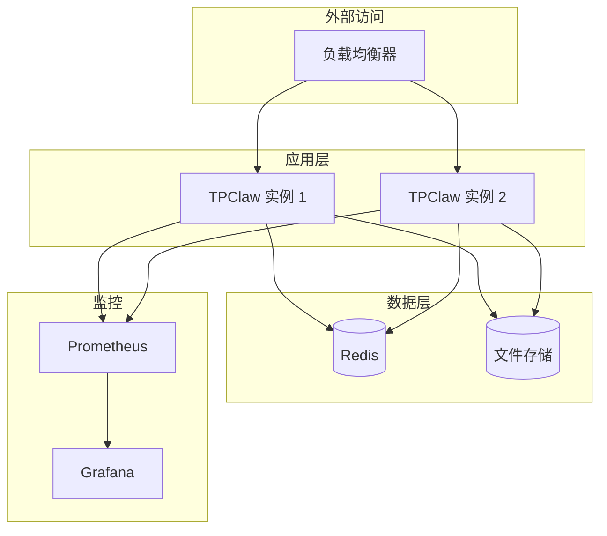

# 生产部署

生产环境部署 TPCLAW 的最佳实践。

## 部署架构



## 系统要求

### 硬件要求

| 配置项 | 最低要求 | 推荐配置 |
|--------|---------|---------|
| CPU | 2 核 | 4 核+ |
| 内存 | 4 GB | 8 GB+ |
| 存储 | 50 GB SSD | 100 GB+ SSD |

### 软件要求

- 操作系统：Linux (Ubuntu 22.04+ / CentOS 8+)
- Docker 20.10+
- Docker Compose 2.0+

## 配置优化

### 服务器配置

```yaml
# config.yaml
server:
  host: "0.0.0.0"
  port: 9527

# 日志配置
logging:
  level: "info"
  format: "json"
  output:
    stdout: true
    file:
      enabled: true
      path: "logs/app.log"
      max_size: 100
      max_backups: 30
      max_age: 7
      compress: true

# pprof 性能分析（生产环境建议关闭或限制访问）
pprof:
  enable: false
```

### 安全配置

```yaml
security:
  requireAuth: true
  jwtSecretKey: "${JWT_SECRET_KEY}"  # 使用强密钥
  jwtExpireTime: 24
  jwtIssuer: "tpclaw"
  users:
    admin: "${ADMIN_PASSWORD}"  # 使用强密码
```

### 会话配置

```yaml
agents:
  defaults:
    session:
      enabled: true
      storage_path: "sessions"
      max_messages: 100
      default_scope: "per_peer"
    compaction:
      mode: "safeguard"
      target_tokens: 80000
      memory_flush: true
```

## 高可用部署

### Docker Compose 集群

```yaml
version: '3.8'

services:
  tpclaw:
    image: rulego/tpclaw:latest
    deploy:
      replicas: 2
      resources:
        limits:
          cpus: '2'
          memory: 4G
        reservations:
          cpus: '1'
          memory: 2G
      restart_policy:
        condition: on-failure
        delay: 5s
        max_attempts: 3
    ports:
      - "9527:9527"
    volumes:
      - ./data:/app/data
      - ./configs:/app/configs
    environment:
      - TZ=Asia/Shanghai
    healthcheck:
      test: ["CMD", "wget", "-q", "--spider", "http://localhost:9527/health"]
      interval: 30s
      timeout: 10s
      retries: 3
    networks:
      - tpclaw-network

  redis:
    image: redis:7-alpine
    volumes:
      - redis_data:/data
    command: redis-server --appendonly yes
    networks:
      - tpclaw-network

networks:
  tpclaw-network:

volumes:
  redis_data:
```

### Kubernetes 部署

```yaml
# deployment.yaml
apiVersion: apps/v1
kind: Deployment
metadata:
  name: tpclaw
spec:
  replicas: 3
  selector:
    matchLabels:
      app: tpclaw
  template:
    metadata:
      labels:
        app: tpclaw
    spec:
      containers:
      - name: tpclaw
        image: rulego/tpclaw:latest
        ports:
        - containerPort: 9527
        resources:
          limits:
            cpu: "2"
            memory: "4Gi"
          requests:
            cpu: "1"
            memory: "2Gi"
        livenessProbe:
          httpGet:
            path: /health
            port: 9527
          initialDelaySeconds: 10
          periodSeconds: 30
        readinessProbe:
          httpGet:
            path: /health
            port: 9527
          initialDelaySeconds: 5
          periodSeconds: 10
        volumeMounts:
        - name: data
          mountPath: /app/data
        - name: config
          mountPath: /app/configs
      volumes:
      - name: data
        persistentVolumeClaim:
          claimName: tpclaw-data
      - name: config
        configMap:
          name: tpclaw-config
---
apiVersion: v1
kind: Service
metadata:
  name: tpclaw
spec:
  selector:
    app: tpclaw
  ports:
  - port: 9527
    targetPort: 9527
  type: LoadBalancer
```

## 监控配置

### Prometheus 指标

TPCLAW 通过 pprof 暴露性能指标：

```yaml
# prometheus.yml
scrape_configs:
  - job_name: 'tpclaw'
    static_configs:
      - targets: ['tpclaw:6060']
```

### 关键指标

| 指标 | 说明 | 告警阈值 |
|------|------|---------|
| CPU 使用率 | 进程 CPU 占用 | > 80% |
| 内存使用率 | 进程内存占用 | > 85% |
| 请求延迟 | API 响应时间 | > 5s |
| 错误率 | 请求失败比例 | > 5% |

### Grafana 仪表盘

导入 Go 应用监控仪表盘，监控：

- Goroutine 数量
- GC 频率和耗时
- 堆内存使用
- 请求 QPS

## 日志管理

### 日志收集

使用 ELK 或 Loki 收集日志：

```yaml
# docker-compose.yml 添加日志驱动
services:
  tpclaw:
    logging:
      driver: "fluentd"
      options:
        fluentd-address: "localhost:24224"
        tag: "tpclaw"
```

### 日志格式

生产环境使用 JSON 格式：

```yaml
logging:
  format: "json"
```

日志示例：

```json
{
  "level": "info",
  "time": "2024-01-15T10:00:00Z",
  "msg": "Request processed",
  "method": "POST",
  "path": "/api/v1/chat/completions",
  "status": 200,
  "duration": 1234
}
```

## 备份策略

### 数据备份

```bash
#!/bin/bash
# backup.sh

BACKUP_DIR="/backup"
DATE=$(date +%Y%m%d)

# 备份数据目录
tar -czf $BACKUP_DIR/data-$DATE.tar.gz ./data

# 备份配置
tar -czf $BACKUP_DIR/config-$DATE.tar.gz ./configs

# 保留最近 7 天的备份
find $BACKUP_DIR -name "*.tar.gz" -mtime +7 -delete
```

### 定时备份

```bash
# crontab -e
0 2 * * * /path/to/backup.sh
```

## 安全加固

### 网络安全

1. **防火墙配置**：只开放必要端口
2. **HTTPS**：使用 SSL/TLS 加密
3. **IP 白名单**：限制管理接口访问

### 应用安全

1. **认证**：启用 JWT 认证
2. **密钥管理**：使用环境变量或密钥管理服务
3. **定期更新**：保持依赖更新

### 数据安全

1. **加密存储**：敏感数据加密
2. **访问控制**：最小权限原则
3. **审计日志**：记录关键操作

## 性能优化

### 连接池

```yaml
# 系统级优化
# /etc/sysctl.conf
net.core.somaxconn = 65535
net.ipv4.tcp_max_syn_backlog = 65535
net.ipv4.ip_local_port_range = 1024 65535
```

### 资源限制

```yaml
# docker-compose.yml
deploy:
  resources:
    limits:
      cpus: '2'
      memory: 4G
```

### 缓存配置

- 启用 Redis 缓存会话
- 配置合理的过期时间

## 故障恢复

### 健康检查

```bash
# 检查服务状态
curl http://localhost:9527/health

# 检查进程
ps aux | grep tpclaw
```

### 自动重启

```yaml
restart: unless-stopped
```

### 数据恢复

```bash
# 恢复数据
tar -xzf backup/data-20240115.tar.gz -C ./
```

## 相关文档

- [Docker 部署](/guide/deployment/docker) - Docker 部署指南
- [监控告警](/guide/deployment/monitoring) - 监控配置
- [配置文件](/guide/configuration/config-file) - 配置说明