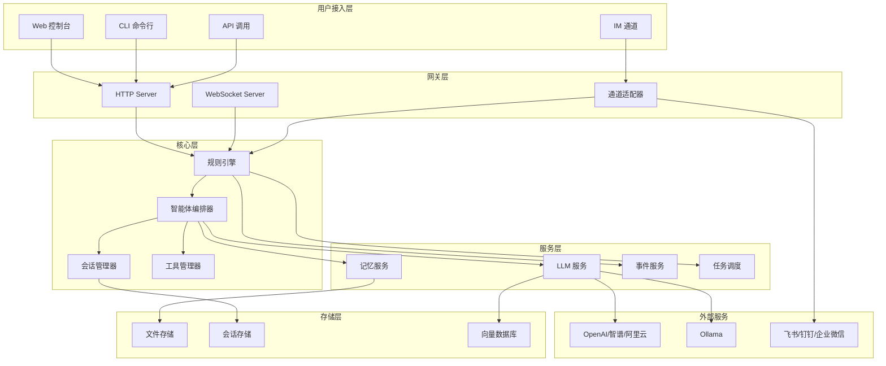
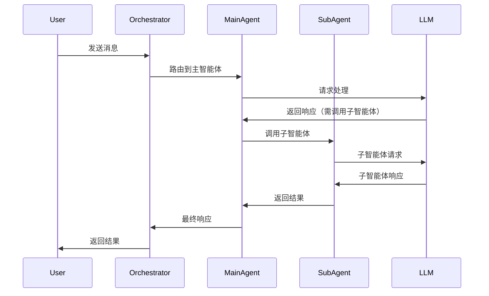
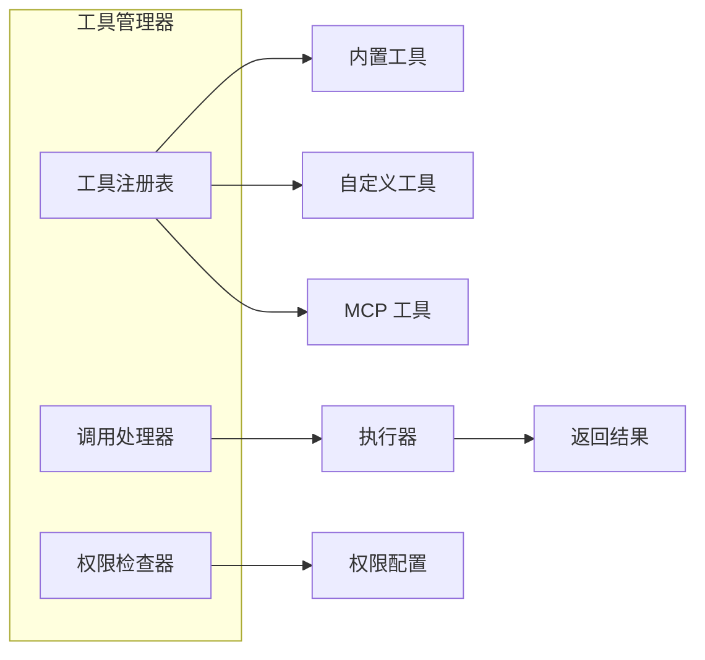
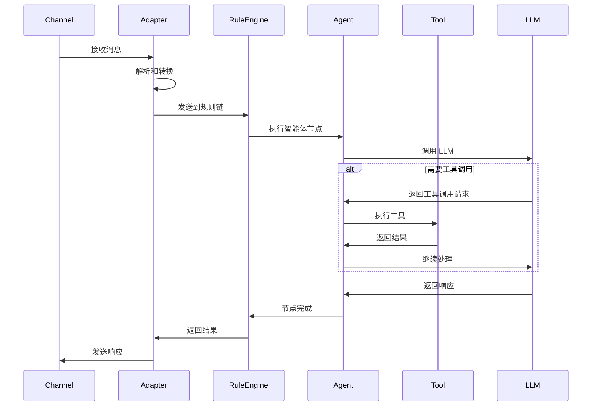
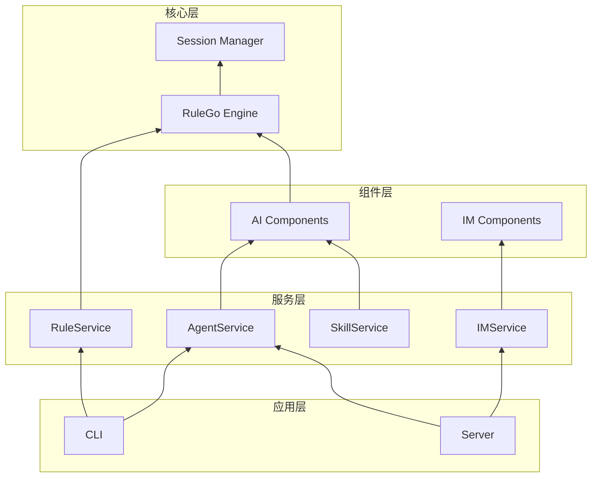
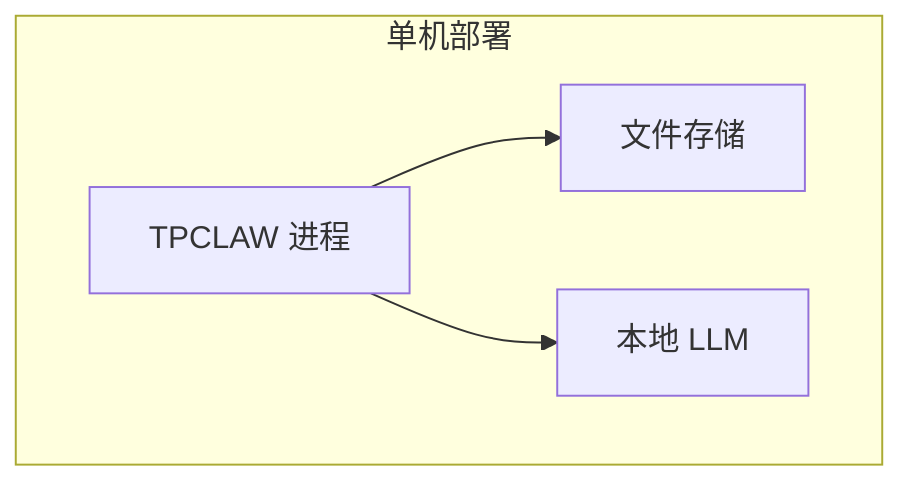
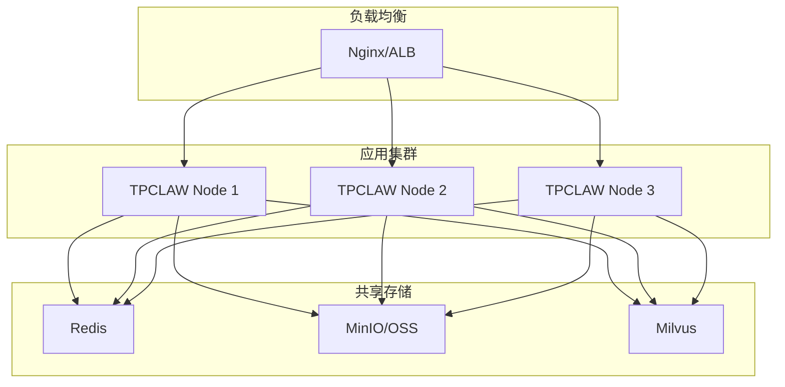

# 架构概览

本文档介绍 TPCLAW 的系统架构和核心组件。

## 整体架构



## 核心组件

### 1. 规则引擎 (RuleGo)

规则引擎是 TPCLAW 的核心，负责：
- 加载和管理规则链
- 执行节点逻辑
- 管理节点之间的连接
- 处理消息路由

```go
// 规则引擎初始化
config := rulego.NewConfig()
ruleEngine, _ := rulego.New("default", []byte(ruleChainJson), rulego.WithConfig(config))

// 执行规则链
ruleEngine.OnMsg(msg, ctx)
```

### 2. 智能体编排器

智能体编排器负责：
- 管理智能体生命周期
- 协调多智能体协作
- 处理工具调用
- 管理 LLM 交互



### 3. 会话管理器

会话管理器负责：
- 会话创建和销毁
- 上下文维护
- 历史记录管理
- 会话压缩

```go
// 会话存储接口
type SessionStorage interface {
    Save(sessionId string, messages []Message) error
    Load(sessionId string) ([]Message, error)
    Delete(sessionId string) error
}
```

### 4. 工具管理器

工具管理器负责：
- 工具注册和发现
- 工具调用执行
- 权限控制
- 结果处理



## 数据流

### 消息处理流程



## 目录结构

```
tpclaw/
├── cmd/                          # 应用入口
│   ├── cli/                      # CLI 工具
│   │   ├── main.go
│   │   └── commands/             # Cobra 命令
│   └── server/                   # HTTP 服务
│       └── main.go
│
├── internal/                     # 内部包
│   ├── api/                      # HTTP API
│   │   └── handler/              # 请求处理器
│   ├── command/                  # 命令处理框架
│   ├── components/               # 组件注册
│   │   ├── ai/                   # AI 组件
│   │   └── im/                   # IM 组件
│   ├── config/                   # 配置管理
│   ├── domain/                   # 领域模型
│   ├── processor/                # 消息处理器
│   ├── service/                  # 业务服务
│   └── session/                  # 会话管理
│
├── configs/                      # 配置文件
│   └── config.yaml
│
├── data/                         # 数据目录
│   ├── agents/                   # 智能体配置
│   └── sessions/                 # 会话数据
│
└── web/                          # Web 前端
    └── src/
```

## 组件依赖



## 部署架构

### 单机部署



### 分布式部署



## 扩展点

TPCLAW 提供了多个扩展点：

| 扩展点 | 说明 | 方式 |
|--------|------|------|
| 自定义节点 | 添加新的处理节点 | 实现 Node 接口 |
| 自定义工具 | 添加新的工具 | 实现 Tool 接口 |
| 自定义通道 | 添加新的 IM 通道 | 实现 Channel 接口 |
| 切面编程 | 添加横切关注点 | 注册 Aspect |
| 事件监听 | 监听系统事件 | 订阅 Event |

## 下一步

- [与其他方案对比](/guide/introduction/comparison) - 了解 TPCLAW 的优势
- [安装指南](/guide/getting-started/installation) - 开始安装
- [核心功能](/guide/core-features/agents) - 了解核心功能
