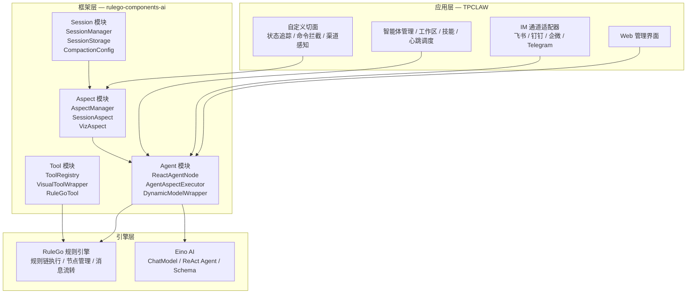
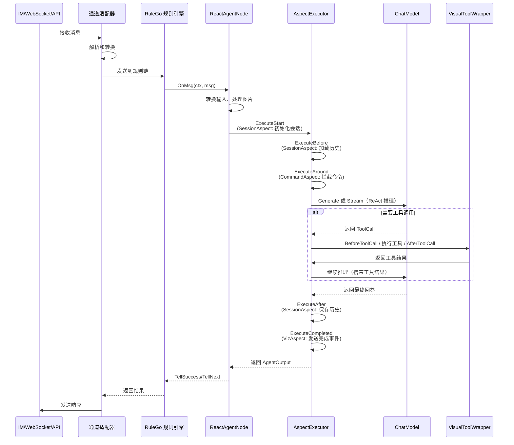

# 架构概览

本文档介绍 TPCLAW 的系统架构和核心组件。

## 技术栈分层

TPCLAW 采用三层架构，基于 [RuleGo AI 智能体开发框架](https://rulego.cc/pages/ai-agent-overview/) 构建：



| 层级 | 职责 | 代表组件 |
|------|------|----------|
| **应用层** | Web UI、IM 通道接入、智能体管理、心跳调度 | TPCLAW |
| **框架层** | 智能体生命周期管理、工具调度、切面编排、会话管理 | rulego-components-ai |
| **引擎层** | 规则链执行引擎、LLM 调用与 Schema | RuleGo、Eino |

## 数据流

### 消息处理流程

以下展示一次完整的智能体请求处理流程：



## 目录结构

```
tpclaw/
├── cmd/
│   └── tpclaw/                    # 应用入口
│
├── internal/                      # 内部包
│   ├── api/                       # HTTP API + WebSocket
│   ├── app/                       # 应用初始化
│   ├── aspect/                    # 自定义切面（状态追踪、命令拦截等）
│   ├── command/                   # 斜杠命令框架
│   ├── components/                # 组件注册
│   ├── config/                    # 配置管理
│   ├── domain/                    # 领域模型
│   ├── embed/                     # 嵌入资源
│   ├── logger/                    # 日志
│   ├── processor/                 # 消息处理器
│   ├── service/                   # 业务服务
│   ├── session/                   # 会话管理
│   └── upgrade/                   # 自动升级
│
├── configs/                       # 配置文件
│   └── config.yaml
│
├── data/                          # 数据目录
│   ├── agents/                    # 智能体配置
│   └── sessions/                  # 会话数据
│
├── plugins/                       # 插件目录
│
├── scripts/                       # 脚本
│   └── install.sh                 # Linux 安装脚本
│
└── web/                           # Web 前端（Vue 3）
    └── src/
```

## 核心服务

| 服务 | 职责 |
|------|------|
| **AgentService** | 智能体 CRUD、配置管理、模板管理 |
| **RuleService** | 规则链管理、热加载 |
| **RuleExecutor** | 规则链执行，桥接 RuleGo 引擎 |
| **IMService** | IM 通道消息收发、通道注册 |
| **SessionService** | 会话存储、历史管理、压缩 |
| **WorkspaceService** | 工作区文件管理 |
| **SkillService** | 技能管理、ZIP 上传 |
| **CronService** | 定时任务调度（基于规则链） |
| **HeartbeatService** | 心跳任务、活跃时间控制 |
| **ModelService** | LLM 供应商管理、模型配置 |
| **CommandService** | 斜杠命令注册与分发 |
| **EventHub** | 事件总线、可视化推送 |

## 扩展点

TPCLAW 提供了多个扩展点：

| 扩展点 | 说明 | 方式 |
|--------|------|------|
| 自定义节点 | 添加新的处理节点 | 实现 Node 接口，通过 `rulego.Register()` 注册 |
| 自定义工具 | 添加新的工具 | 通过规则链工具、MCP 协议或技能文件 |
| 自定义通道 | 添加新的 IM 通道 | 实现 Channel 接口 |
| 切面编程 | 添加横切关注点 | 注册 Aspect 到 AspectManager |
| 技能扩展 | 定义可复用能力 | 编写 Markdown 技能文件 |

## 下一步

- [核心概念](/guide/introduction/core-concepts) - 了解 TPCLAW 的核心概念
- [安装指南](/guide/getting-started/installation) - 开始安装
- [核心功能](/guide/core-features/agents) - 了解核心功能
- [RuleGo AI 智能体框架架构](https://rulego.cc/pages/ai-agent-architecture/) - 深入了解底层框架架构
