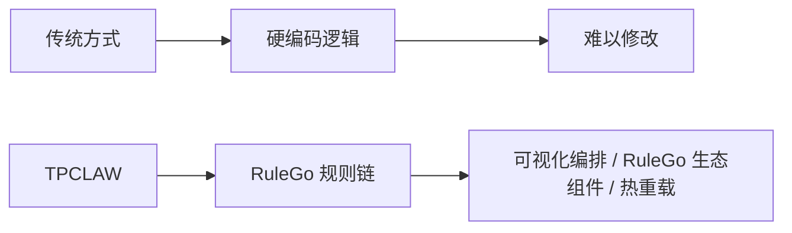

# 与其他方案对比

本文档将 TPCLAW 与市面上的同类 AI 智能体产品进行对比，帮助您选择最适合的方案。

## 对比概览

| 特性 | TPCLAW | OpenClaw | Hermes Agent | Claude Code |
|------|--------|----------|--------------|-------------|
| **语言** | Go | TypeScript | Python | TypeScript |
| **定位** | 自托管智能体平台 | 开源智能体框架 | 自进化智能体框架 | CLI 编程助手 |
| **自托管** | ✅ | ✅ | ✅ | ❌ 云端 |
| **Web 管理界面** | ✅ | ❌ | ✅ | ❌ |
| **可视化编排智能体** | ✅ 拖拽式 + RuleGo 生态组件 | ❌ | ❌ | ❌ |
| **IM 多通道** | 飞书/企业微信 | 多平台 | 14+ 平台 | ❌ |
| **OpenAI 协议兼容** | ✅ | ❌ | ❌ | ❌ |
| **技能兼容性** | OpenClaw/Claude Code | OpenClaw 格式 | 自有格式 | Claude Code 格式 |
| **自主进化** | ✅ 记忆 + 心跳 | ⚠️ 有限 | ✅ GEPA 学习引擎 | ❌ |
| **定时任务** | ✅ 自然语言创建 | ✅ | ✅ | ❌ |
| **多智能体协作** | ✅ 子智能体 + 路由 | ⚠️ 有限 | ✅ 并行任务 | ❌ |
| **浏览器自动化** | ✅ | ✅ | ✅ | ❌ |
| **资源占用** | 低 | 高 | 中 | 无（云端） |

## 详细对比

### TPCLAW vs OpenClaw

| 方面 | TPCLAW | OpenClaw |
|------|--------|----------|
| **架构** | Go + RuleGo 规则引擎 | Node.js + TypeScript |
| **部署** | 单二进制，秒级启动 | Node.js 运行时，依赖多 |
| **资源占用** | 低内存，高并发 | 较高，需要 Node.js 环境 |
| **流程编排** | ✅ 可视化拖拽编辑规则链 | ❌ 纯代码配置 |
| **IM 集成** | 飞书/企业微信长连接 | 多平台但主要面向海外 |
| **中国企业适配** | ✅ 原生支持飞书、企业微信 | ⚠️ 需要额外开发 |
| **技能兼容** | ✅ 兼容 OpenClaw 技能格式 | 自有格式 |

**选择建议**：
- 选择 **TPCLAW**：需要 Web 管理界面、中国企业 IM 集成、低资源部署、可视化编排
- 选择 **OpenClaw**：熟悉 Node.js 生态、面向海外用户、需要丰富的社区技能

### TPCLAW vs Hermes Agent（爱马仕）

| 方面 | TPCLAW | Hermes Agent |
|------|--------|--------------|
| **架构** | Go + RuleGo 规则引擎 | Python + 闭环学习引擎 |
| **部署** | 单二进制 | Python 环境 + 依赖安装 |
| **自我进化** | 文件记忆 + 心跳驱动 | GEPA 学习引擎 + 三层记忆 |
| **模型支持** | 兼容 OpenAI 协议的任意供应商 | 200+ 模型一键切换 |
| **IM 集成** | 飞书/企业微信长连接 | 14+ 平台（含国内平台） |
| **API 对外服务** | ✅ OpenAI 协议兼容 | ❌ |
| **性能** | 高并发、低内存 | 中等（Python 开销） |
| **可视化** | ✅ 规则链拖拽编排 | ❌ |

**选择建议**：
- 选择 **TPCLAW**：需要对外提供 API 服务、高性能部署、可视化编排、Go 技术栈
- 选择 **Hermes Agent**：看重自我进化能力、多平台 IM 覆盖、Python 生态

### TPCLAW vs Claude Code

| 方面 | TPCLAW | Claude Code |
|------|--------|-------------|
| **定位** | 通用智能体平台 | 编程助手 |
| **部署** | 自托管 | 云端服务 |
| **使用方式** | Web UI / IM / API | CLI 命令行 |
| **IM 集成** | ✅ 飞书/企业微信 | ❌ |
| **定时任务** | ✅ | ❌ |
| **团队协作** | ✅ 多人通过 IM 使用 | ⚠️ 个人使用为主 |
| **技能兼容** | ✅ 兼容 Claude Code 技能 | 自有格式 |
| **数据隐私** | ✅ 完全自托管 | ⚠️ 数据经 Anthropic |

**选择建议**：
- 选择 **TPCLAW**：需要通用智能体能力、团队 IM 协作、数据自托管、定时任务
- 选择 **Claude Code**：专注编程场景、需要顶级代码理解能力

## TPCLAW 独特优势

### 1. 规则链驱动的智能体架构

智能体和工作流都以 RuleGo 规则链（JSON）定义，不是代码。通过可视化拖拽编辑器编排，可直接使用 RuleGo 丰富的生态组件，修改即时生效，无需编译部署。

### 2. OpenAI 协议兼容

每个智能体暴露独立的 OpenAI Chat Completions API 端点，已有 OpenAI 应用只需改 `base_url` 即可接入，零改造成本。

### 3. 中国企业 IM 原生支持

飞书、企业微信通过 WebSocket 长连接接入，扫码即用，无需公网 IP 和复杂配置。

### 4. 高性能 Go 架构

单二进制部署，秒级启动，低内存高并发，适合资源受限的生产环境。

### 5. 技能生态兼容

兼容 OpenClaw、Claude Code 等主流技能格式，直接导入即可使用，无需重写。

## 下一步

- [快速开始](/guide/getting-started/quickstart) - 开始使用 TPCLAW
- [核心概念](/guide/introduction/core-concepts) - 深入了解核心概念
- [架构概览](/guide/introduction/architecture) - 系统架构详解
