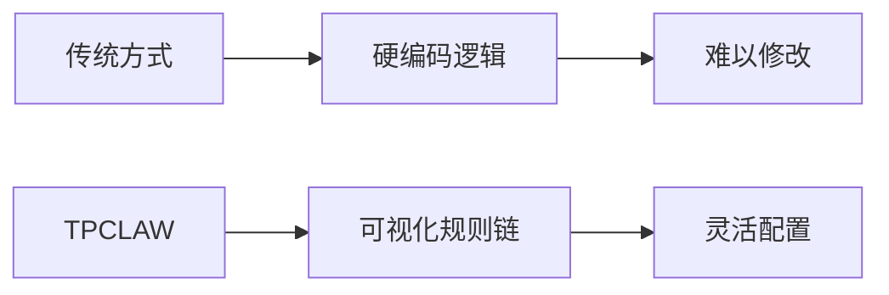
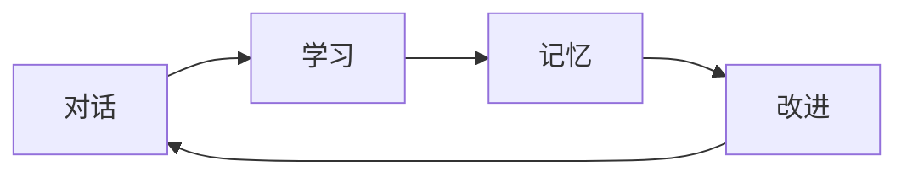

# 与其他方案对比

本文档将 TPCLAW 与其他流行的 AI 智能体框架进行对比，帮助您选择最适合的方案。

## 对比概览

| 特性 | TPCLAW | OpenClaw | LangChain | AutoGen | CrewAI |
|------|--------|----------|-----------|---------|--------|
| **语言** | Go | Node.js | Python | Python | Python |
| **核心引擎** | 内置编排引擎 | Gateway | Chain | Agent | Crew |
| **自托管** | ✅ | ✅ | ✅ | ✅ | ✅ |
| **多智能体** | ✅ | ✅ | ❌ | ✅ | ✅ |
| **规则编排** | ✅ | ❌ | ❌ | ❌ | ❌ |
| **IM 集成** | ✅ | ✅ | ❌ | ❌ | ❌ |
| **可视化设计** | ✅ | ✅ | ❌ | ❌ | ❌ |
| **工具扩展** | ✅ | ✅ | ✅ | ✅ | ✅ |

## 详细对比

### TPCLAW vs OpenClaw

两者都是自托管的 AI 智能体平台，但在技术实现上有所不同：

| 方面 | TPCLAW | OpenClaw |
|------|--------|----------|
| **技术栈** | Go + RuleGo | Node.js |
| **性能** | 高并发，低内存 | 中等 |
| **部署** | 单二进制 | 需要 Node.js 环境 |
| **编排方式** | 规则链可视化编排 | 内置 Agent 模式 |
| **扩展性** | 组件化插件系统 | 内置工具 |
| **IM 通道** | 飞书、钉钉、企业微信、Telegram | WhatsApp、Telegram、Discord、iMessage |

**选择建议**：
- 选择 **TPCLAW**：需要高性能、中国企业 IM 集成、灵活的规则编排
- 选择 **OpenClaw**：熟悉 Node.js 生态、需要海外 IM 通道

### TPCLAW vs LangChain

| 方面 | TPCLAW | LangChain |
|------|--------|-----------|
| **定位** | 完整的智能体平台 | LLM 应用框架 |
| **开箱即用** | ✅ 完整解决方案 | ❌ 需要自行组装 |
| **学习曲线** | 中等 | 较陡 |
| **灵活性** | 规则链约束 | 高度自由 |
| **企业特性** | ✅ IM 集成、会话管理 | ❌ 需要额外开发 |
| **社区生态** | 发展中 | 非常丰富 |

**选择建议**：
- 选择 **TPCLAW**：需要完整的智能体解决方案、企业级功能
- 选择 **LangChain**：需要高度定制、Python 生态集成

### TPCLAW vs AutoGen

| 方面 | TPCLAW | AutoGen |
|------|--------|---------|
| **多智能体** | 规则链协调 | 对话式协调 |
| **协调模式** | Supervisor/React/Deep | Conversation |
| **可视化** | ✅ 规则链设计器 | ❌ 纯代码 |
| **生产就绪** | ✅ | ⚠️ 实验性 |
| **IM 集成** | ✅ | ❌ |
| **记忆系统** | ✅ 内置 | ⚠️ 需配置 |

**选择建议**：
- 选择 **TPCLAW**：生产环境部署、需要可视化管理
- 选择 **AutoGen**：研究多智能体对话模式

### TPCLAW vs CrewAI

| 方面 | TPCLAW | CrewAI |
|------|--------|--------|
| **智能体模式** | 规则链驱动 | 角色扮演 |
| **任务分配** | 规则配置 | Crew 定义 |
| **工具生态** | Go 生态 | Python/LangChain |
| **企业集成** | ✅ IM 通道 | ❌ |
| **性能** | 高 | 中等 |

**选择建议**：
- 选择 **TPCLAW**：高性能需求、企业集成
- 选择 **CrewAI**：角色扮演场景、Python 生态

## TPCLAW 独特优势

### 1. 规则引擎驱动

TPCLAW 使用 RuleGo 规则引擎，让您可以：
- **可视化设计** 工作流
- **热更新** 规则配置
- **条件分支** 和复杂路由
- **组件复用** 和组合

### 2. 企业级 IM 集成

原生支持中国企业常用的 IM 平台：

- **飞书**: 完整的事件订阅、消息卡片支持
- **钉钉**: 机器人、回调、消息推送
- **企业微信**: 应用消息、群机器人

### 3. 高性能架构

基于 Go 语言构建：
- **高并发**: 轻松处理大量并发请求
- **低内存**: 相比 Node.js/Python 更低的资源消耗
- **快速启动**: 单二进制部署，秒级启动

### 4. 自我进化能力

- **长期记忆**: 持久化重要信息
- **每日日志**: 自动记录工作内容
- **心跳任务**: 定期自我检查和优化

### 5. 灵活扩展

| 扩展点 | 说明 |
|--------|------|
| 自定义节点 | 实现特定业务逻辑 |
| 自定义工具 | 添加领域专用工具 |
| 自定义通道 | 接入新的 IM 平台 |
| 切面编程 | 添加日志、监控等 |

## 使用场景对比

| 场景 | 推荐方案 |
|------|----------|
| 企业内部 AI 助手 | TPCLAW |
| 个人开发学习 | LangChain |
| 多智能体研究 | AutoGen |
| 角色扮演应用 | CrewAI |
| 海外 IM 集成 | OpenClaw |
| 高性能生产部署 | TPCLAW |

## 迁移指南

### 从 OpenClaw 迁移

1. **概念映射**:
   - Gateway → RuleGo 规则引擎
   - Agent → 智能体节点
   - Tool → 内置/自定义工具

2. **配置迁移**:
   - OpenClaw 使用 JSON 配置
   - TPCLAW 使用 YAML + 规则链 JSON

3. **IM 通道**:
   - OpenClaw 支持 WhatsApp、Discord
   - TPCLAW 支持飞书、钉钉、企业微信

### 从 LangChain 迁移

1. **链转换**:
   - LangChain Chain → TPCLAW 规则链
   - 逐个节点转换

2. **工具迁移**:
   - LangChain Tool → TPCLAW Tool
   - 实现相同的接口

3. **记忆系统**:
   - LangChain Memory → TPCLAW 记忆系统
   - 配置工作空间文件

## 总结

TPCLAW 是一个适合以下场景的选择：

- **企业级部署**: 需要高性能、稳定性
- **中国企业环境**: 需要飞书、钉钉等 IM 集成
- **灵活编排**: 需要可视化规则链设计
- **自托管需求**: 对数据隐私有严格要求

如果您的需求更偏向研究实验、Python 生态集成，或者需要海外 IM 通道，可以考虑其他方案。

## 下一步

- [快速开始](/guide/getting-started/installation) - 开始使用 TPCLAW
- [核心概念](/guide/introduction/core-concepts) - 深入了解核心概念
