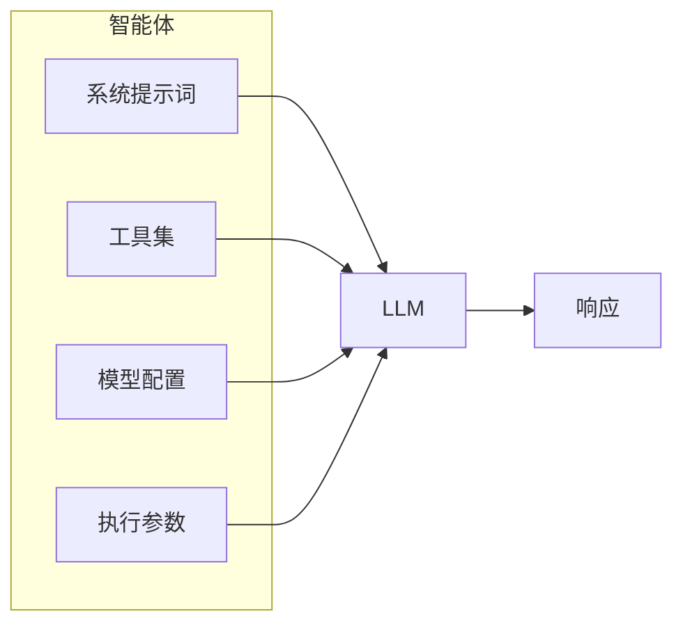
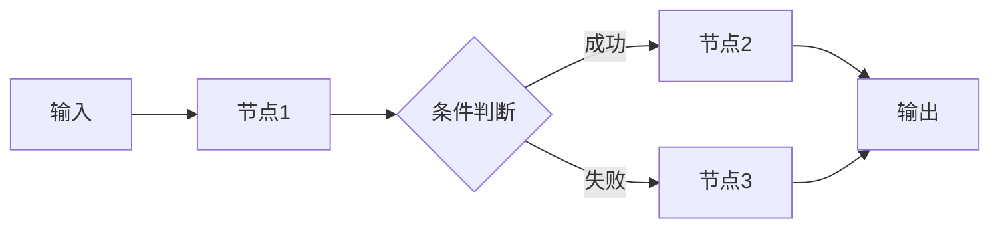
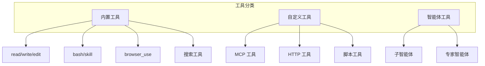
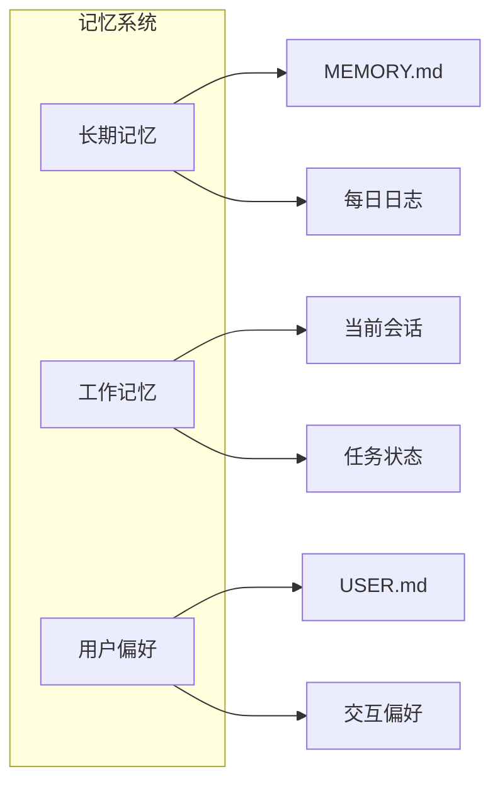

# 核心概念

在深入使用 TPCLAW 之前，了解以下核心概念将帮助您更好地理解和使用平台。

## 智能体 (Agent)

智能体是 TPCLAW 的核心执行单元，它负责接收用户请求、调用工具、与 LLM 交互，并生成响应。

### 智能体组成



### 智能体类型

| 类型 | 说明 | 使用场景 |
|------|------|----------|
| **主智能体** | 负责任务分解和协调 | 复杂任务处理 |
| **专家智能体** | 专注于特定领域 | 图片识别、代码生成 |
| **工具智能体** | 封装工具调用能力 | 文件操作、网络请求 |

### 智能体配置示例

```json
{
  "id": "main",
  "name": "TeamClaw",
  "type": "ai/agent",
  "configuration": {
    "model": "gpt-4",
    "systemPrompt": "你是一个智能助手...",
    "tools": [
      {"type": "builtin", "name": "read"},
      {"type": "builtin", "name": "write"}
    ],
    "maxStep": 100
  }
}
```

## 规则链 (Rule Chain)

规则链是 TPCLAW 的工作流编排核心，它定义了消息处理的流程和逻辑。

### 规则链结构



### 核心元素

| 元素 | 说明 |
|------|------|
| **节点 (Node)** | 执行特定任务的处理单元 |
| **连接 (Connection)** | 定义节点之间的流转关系 |
| **关系类型** | Success、Failure、Stream 等 |

### 规则链示例

```json
{
  "ruleChain": {
    "id": "main",
    "name": "主规则链"
  },
  "metadata": {
    "nodes": [
      {"id": "node1", "type": "ai/agent"},
      {"id": "node2", "type": "end"}
    ],
    "connections": [
      {"fromId": "node1", "toId": "node2", "type": "Success"}
    ]
  }
}
```

## 工具 (Tool)

工具是智能体与外部世界交互的能力扩展，让智能体能够执行实际操作。

### 工具类型



### 工具配置

```json
{
  "type": "builtin",
  "name": "read",
  "description": "读取文件内容",
  "config": {
    "maxReadLines": 2000,
    "workDir": "/workspace"
  }
}
```

### 工具调用流程

1. LLM 决定需要调用工具
2. 生成工具调用请求（包含工具名和参数）
3. 平台执行工具并返回结果
4. LLM 根据结果继续处理

## 技能 (Skill)

技能是预定义的任务模板，封装了特定的能力和知识。

### 技能文件结构

```
workspace/skills/
├── weather.md        # 天气查询技能
├── translation.md    # 翻译技能
├── code_review.md    # 代码审查技能
└── summary.md        # 文本摘要技能
```

### 技能文件示例

```markdown
# 天气查询

## 描述
查询指定城市的天气信息

## 使用场景
- 用户询问天气
- 需要了解天气状况

## 参数
- city: 城市名称（必需）
- date: 日期（可选，默认今天）

## 步骤
1. 使用 browser_use 访问天气网站
2. 提取天气信息
3. 格式化返回结果
```

## 会话 (Session)

会话管理用户与智能体之间的对话上下文。

### 会话特性

| 特性 | 说明 |
|------|------|
| **上下文保持** | 保持对话历史和状态 |
| **会话隔离** | 不同用户/通道的会话独立 |
| **上下文压缩** | 自动压缩过长的对话历史 |
| **持久化** | 支持会话持久化存储 |

### 会话存储

```
data/sessions/
├── user_001/
│   ├── main.json       # 主智能体会话
│   └── agent01.json    # 子智能体会话
└── user_002/
    └── main.json
```

## 记忆 (Memory)

记忆系统让智能体能够长期记住重要信息。

### 记忆类型



### 记忆文件

| 文件 | 说明 |
|------|------|
| `MEMORY.md` | 长期记忆存储 |
| `USER.md` | 用户画像和偏好 |
| `HEARTBEAT.md` | 心跳任务记录 |

## 通道 (Channel)

通道是用户与智能体交互的入口。

### 支持的通道

| 通道 | 类型 | 说明 |
|------|------|------|
| 飞书 | IM | 支持机器人、事件订阅 |
| 钉钉 | IM | 支持机器人、回调 |
| 企业微信 | IM | 支持应用消息 |
| Telegram | IM | 支持 Bot |
| WebSocket | 通用 | 自定义接入 |

### 通道配置

```yaml
channels:
  feishu:
    enabled: true
    app_id: "cli_xxx"
    app_secret: "xxx"
  dingtalk:
    enabled: true
    client_id: "xxx"
    client_secret: "xxx"
```

## 绑定 (Binding)

绑定定义了通道与智能体之间的映射关系。

### 绑定规则

```yaml
bindings:
  - channel: feishu
    agent: main
    patterns:
      - ".*"  # 匹配所有消息

  - channel: dingtalk
    agent: customer_service
    patterns:
      - "客服.*"
      - "帮助.*"
```

## 工作空间 (Workspace)

工作空间是智能体的"大脑"，包含所有配置和记忆文件。

### 工作空间结构

```
workspace/
├── BOOTSTRAP.md      # 引导脚本
├── IDENTITY.md       # 身份定义
├── AGENTS.md         # 工作流程
├── SOUL.md           # 核心价值观
├── TOOLS.md          # 工具说明
├── USER.md           # 用户画像
├── MEMORY.md         # 长期记忆
├── HEARTBEAT.md      # 心跳任务
└── skills/           # 技能目录
    ├── skill1.md
    └── skill2.md
```

### 模板文件作用

| 文件 | 作用 |
|------|------|
| `BOOTSTRAP.md` | 首次启动时的引导脚本 |
| `IDENTITY.md` | 定义智能体的身份和角色 |
| `AGENTS.md` | 定义工作流程和协作规则 |
| `SOUL.md` | 定义核心价值观和行为准则 |
| `TOOLS.md` | 工具使用说明和最佳实践 |
| `USER.md` | 用户画像和偏好设置 |

## 下一步

- [架构概览](/guide/introduction/architecture) - 了解系统架构
- [智能体配置](/guide/core-features/agents) - 详细配置智能体
- [规则链设计](/guide/core-features/rule-chains) - 设计工作流
