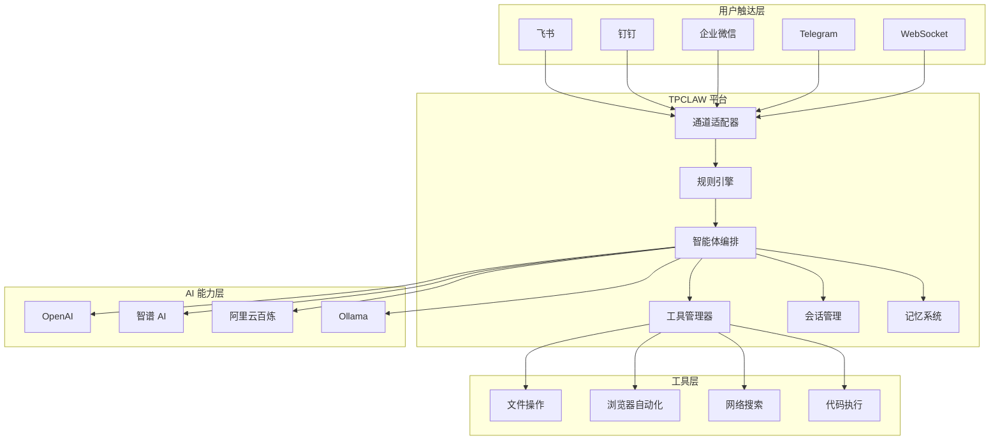

# 什么是 TPCLAW

TPCLAW（TeamClaw）是一个**自托管**的 AI 智能体平台。它将可视化编排能力与现代 AI 技术相结合，让您可以轻松构建、部署和管理复杂的 AI 智能体系统。

## 概述

TPCLAW 的核心理念是"**可视化编排，智能驱动**"。通过可视化设计，您可以灵活地组合各种 AI 能力、工具和通道， 构建出满足特定业务需求的智能体应用。



## 核心特性

### 自托管

- **数据主权**: 所有数据完全存储在您自己的服务器上
- **隐私保护**: 敏感信息不会传输到第三方服务
- **合规性**: 满足企业级数据安全要求
- **离线能力**: 支持 Ollama 等本地模型，实现完全离线运行

### 多智能体协作

- **主智能体**: 负责任务分解和协调
- **子智能体**: 专注于特定领域的专家智能体
- **动态路由**: 根据任务类型自动选择合适的智能体
- **并行执行**: 支持多个子智能体并行处理任务

### 可视化编排

- **可视化编排**: 通过可视化设计工作流
- **灵活组合**: 自由组合各种节点和组件
- **动态加载**: 支持热更新配置
- **条件分支**: 支持复杂的条件判断和路由

### 丰富工具集

| 工具 | 说明 |
|------|------|
| `read` | 文件读取、内容搜索、目录列表 |
| `write` | 文件写入、覆盖、追加 |
| `edit` | 行级编辑、搜索替换、备份恢复 |
| `bash` | Shell 命令执行 |
| `skill` | 技能调用 |
| `browser_use` | 浏览器自动化 |
| `duckduckgo` | DuckDuckGo 搜索 |
| `bingsearch` | Bing 搜索 |

### IM 多通道

支持多种主流 IM 平台的一键接入：

- **飞书**: 支持机器人、事件订阅、消息卡片
- **钉钉**: 支持机器人、回调、消息推送
- **企业微信**: 支持应用消息、群机器人
- **Telegram**: 支持 Bot、Webhook
- **WebSocket**: 自定义通道接入

### 记忆与进化

- **长期记忆**: 持久化存储重要信息
- **每日日志**: 记录智能体的工作内容
- **心跳任务**: 定期执行自我检查和维护
- **自我改进**: 从对话中学习和积累经验

## 适用场景

### 个人开发者

- 构建**个人 AI 助手**，帮助处理日常事务
- **自动化工作流**，提高开发效率
- **学习和实验** AI 技术

### 企业团队

- **内部知识库问答**，快速获取信息
- **客服机器人**，7x24 小时响应客户
- **业务流程自动化**，减少重复劳动
- **数据分析和报告**，自动生成洞察

### AI 研究者

- **快速原型开发**，验证新想法
- **多智能体系统研究**，探索协作模式
- **工具使用研究**，测试工具调用能力

## 技术栈

| 层级 | 技术 |
|------|------|
| 后端 | Go 1.24+ |
| 规则引擎 | RuleGo |
| AI 框架 | 字节跳动 Eino |
| 前端 | Vue 3 + Vite |
| 存储 | 文件系统 / Redis |
| 容器化 | Docker |

## 与 OpenClaw 的关系

TPCLAW 的设计灵感部分来自 [OpenClaw](https://docs.openclaw.ai)，但在技术实现上有显著不同：

| 特性 | TPCLAW | OpenClaw |
|------|--------|----------|
| 语言 | Go | Node.js |
| 智能体模式 | 可视化编排 | 内置 Agent |
| 工具扩展 | 组件化插件 | 内置工具 |
| 可视化 | Web Dashboard |

## 快速开始

```bash
# 克隆仓库
git clone https://github.com/teambuf/tpclaw.git
cd tpclaw

# 安装依赖
go mod download

# 配置 API Key
export OPENAI_API_KEY="your-api-key"

# 启动服务
go run cmd/server/main.go
```

打开浏览器访问 http://127.0.0.1:9527 开始使用！

## 下一步

- [核心概念](/guide/introduction/core-concepts) - 了解 TPCLAW 的核心概念
- [架构概览](/guide/introduction/architecture) - 深入了解系统架构
- [快速开始](/guide/getting-started/installation) - 开始安装和配置
