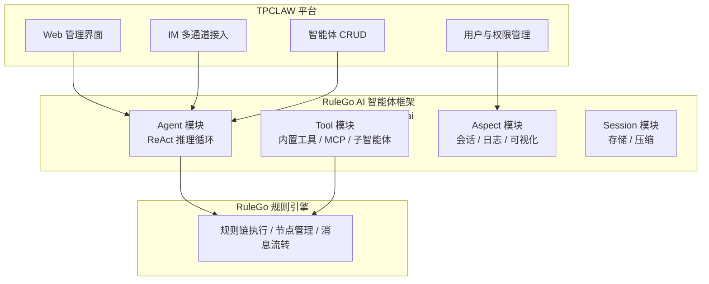

# 什么是 TPCLAW

TPCLAW（TeamClaw）是一个**自托管**的 AI 智能体平台，基于 [RuleGo 规则引擎](https://github.com/rulego/rulego) 和 [RuleGo AI 智能体开发框架](https://github.com/rulego/rulego-components-ai) 构建。它将可视化规则链编排能力与现代 AI 技术相结合，让您可以轻松构建、部署和管理复杂的 AI 智能体系统。

## 与 RuleGo 智能体框架的关系

TPCLAW 是基于 [RuleGo AI 智能体开发框架](https://rulego.cc/pages/ai-agent-overview/)（rulego-components-ai）构建的**开箱即用的智能体平台**。可以简单理解为：



| 层级 | 组件 | 职责 |
|------|------|------|
| **平台层** | TPCLAW | Web UI、IM 通道、用户管理、智能体管理、心跳调度 |
| **框架层** | rulego-components-ai | ReAct 推理循环、工具系统、AOP 切面、会话管理 |
| **引擎层** | RuleGo 规则引擎 | 规则链编排、节点执行、消息流转 |

> RuleGo AI 框架采用 **"规则链即智能体，智能体即服务"** 的设计理念——每个智能体本质上是一个 RuleGo 规则链，通过 JSON 声明式定义，修改后实时生效，无需编译部署；同时每个智能体对外暴露标准 OpenAI API，即定义即服务。TPCLAW 在此基础上提供了完整的平台功能。

## 概述

TPCLAW 的核心理念是"**自主执行，持续进化**"。智能体不仅能理解你的指令，还能自主规划步骤、调用工具完成任务，并在交互过程中不断积累经验和知识。

**三大核心能力：**

- **自主干活**：给一个目标，智能体会自主拆解任务、规划步骤、调用工具链完成执行。支持文件读写、Shell 命令、浏览器自动化、定时任务等，无需人工逐步干预。
- **自主进化**：智能体具备记忆系统，能从每次交互中积累知识和经验。长期记忆、每日日志、心跳任务让智能体越用越聪明，越用越懂你。
- **技能无限扩展**：兼容 OpenClaw、Claude Code 等市面上所有 Markdown 格式的技能，直接导入即可使用，一键赋予智能体新能力。

## 核心特性

### 自托管

- **数据主权**: 所有数据完全存储在您自己的服务器上
- **隐私保护**: 敏感信息不会传输到第三方服务
- **合规性**: 满足企业级数据安全要求
- **离线能力**: 支持 Ollama 等本地模型，实现完全离线运行

### 多智能体协作

- **主智能体**: 负责任务分解和协调
- **子智能体**: 专注于特定领域的专家智能体
- **动态路由**: 根据任务类型自动选择合适的智能体
- **并行执行**: 支持多个子智能体并行处理任务

### 可视化编排智能体与工作流

TPCLAW 以 [RuleGo 规则引擎](https://github.com/rulego/rulego) 作为底层执行编排器，智能体和工作流都以规则链的形式定义：

- **可视化设计**: 拖拽式编辑器编排智能体行为和工作流
- **RuleGo 生态组件**: 直接使用 RuleGo 丰富的内置节点和社区组件（消息路由、条件分支、数据转换、外部调用等）
- **热重载**: JSON 声明式定义，修改后实时生效，无需编译部署
- **灵活路由**: 支持条件分支、子链调用、并行执行等复杂编排

### 丰富工具集

内置文件读写、Shell 执行、浏览器自动化等工具，支持通过技能无限扩展：

| 工具 | 说明 |
|------|------|
| `read` | 文件读取、内容搜索、目录列表 |
| `write` | 文件写入、覆盖、追加 |
| `edit` | 行级编辑、搜索替换、备份恢复 |
| `bash` | Shell 命令执行 |
| `skill` | 技能调用，兼容 OpenClaw、Claude Code 等所有 Markdown 技能格式 |
| `browser_use` | 浏览器自动化 |

### 智能体即服务

API 通道完全兼容 OpenAI Chat Completions 协议，**任何已接入 OpenAI API 的应用只需修改 `base_url` 和 `api_key`，即可零改造切换到 TpClaw 智能体**。

### IM 多通道

支持多种主流 IM 平台的一键接入：

- **飞书**: 长连接模式，扫码即用，无需公网 IP
- **企业微信**: 智能机器人 API 长连接，自动接入
- **钉钉**: 开发中
- **Telegram**: 开发中
- **WebSocket**: 开发中

### 记忆与进化

- **长期记忆**: 持久化存储重要信息
- **每日日志**: 记录智能体的工作内容
- **心跳任务**: 定期执行自我检查和维护
- **自我改进**: 从对话中学习和积累经验

## 适用场景

### 个人开发者

- 构建**个人 AI 助手**，帮助处理日常事务
- **自动化工作流**，提高开发效率
- **学习和实验** AI 技术

### 企业团队

- **内部知识库问答**，快速获取信息
- **客服机器人**，7x24 小时响应客户
- **业务流程自动化**，减少重复劳动
- **数据分析和报告**，自动生成洞察

### AI 研究者

- **快速原型开发**，验证新想法
- **多智能体系统研究**，探索协作模式
- **工具使用研究**，测试工具调用能力

## 技术栈

| 层级 | 技术 |
|------|------|
| 后端 | Go 1.24+ |
| 规则引擎 | [RuleGo](https://github.com/rulego/rulego) |
| AI 智能体框架 | [rulego-components-ai](https://github.com/rulego/rulego-components-ai) |
| 前端 | Vue 3 + Vite |
| 存储 | 文件系统 |

## 快速开始

```bash
# 克隆仓库
git clone https://github.com/teambuf/tpclaw.git
cd tpclaw

# 安装依赖
go mod download

# 启动服务
go run cmd/tpclaw
```

打开浏览器访问 http://127.0.0.1:9527 开始使用！

## 下一步

- [核心概念](/guide/introduction/core-concepts) - 了解 TPCLAW 的核心概念
- [架构概览](/guide/introduction/architecture) - 深入了解系统架构
- [快速开始](/guide/getting-started/installation) - 开始安装和配置
- [RuleGo AI 智能体框架](https://rulego.cc/pages/ai-agent-overview/) - 了解底层框架的设计理念
