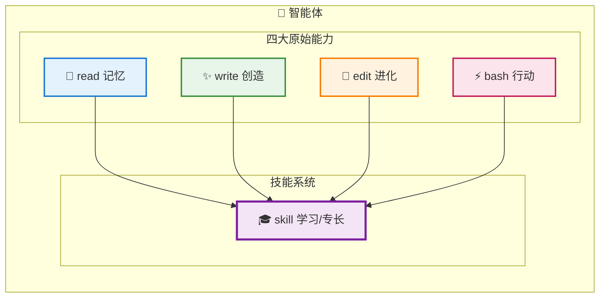
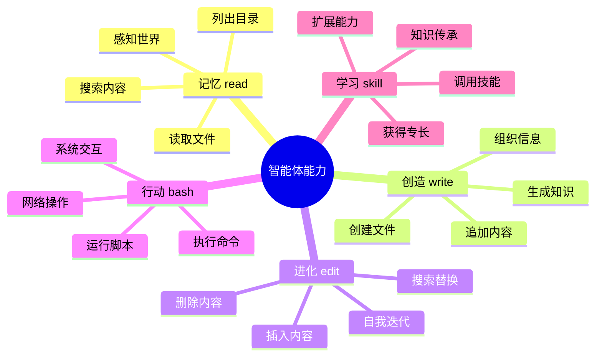

# 工具概述

TPCLAW 智能体通过工具与世界交互。工具是智能体的能力延伸，让智能体能够感知、行动、学习和进化。

## 智能体工具能力模型

TPCLAW 将智能体的核心能力抽象为四大原始工具，并通过技能系统扩展专业能力。

### 能力架构图



### 能力关系图



### 四大原始能力

| 工具 | 能力 | 说明 | 类比 |
|------|------|------|------|
| **read** | 记忆 | 获取/读取信息，感知世界 | 人类的感官与记忆 |
| **write** | 创造 | 创建新内容，生成知识 | 人类的创造力 |
| **edit** | 进化 | 修改/改进现有内容，自我迭代 | 人类的学习与成长 |
| **bash** | 行动 | 执行命令，与世界交互 | 人类的行动力 |

### 技能系统（skill）

| 工具 | 能力 | 说明 | 类比 |
|------|------|------|------|
| **skill** | 学习/专长 | 调用预定义技能，获得特定领域专业能力 | 人类的专业技能培训 |

**skill 相当于"学习"或"专长"**——智能体通过 skill 工具扩展核心能力，获得特定领域的专业知识，就像人类通过学习获得专业技能一样。

## 工具分类

### 内置工具

内置工具是智能体的基础能力，开箱即用：

| 工具 | 能力 | 说明 |
|------|------|------|
| [read](/guide/tools/read) | 记忆 | 读取文件内容、搜索内容、列出目录 |
| [write](/guide/tools/write) | 创造 | 写入内容到文件，支持创建、覆盖、追加 |
| [edit](/guide/tools/edit) | 进化 | 文件编辑，支持搜索替换、插入删除 |
| [bash](/guide/tools/bash) | 行动 | 执行 Shell 命令，与系统交互 |
| [skill](/guide/tools/skill) | 学习 | 调用预定义技能，扩展专业能力 |
| [browser-use](/guide/tools/browser-use) | 行动 | 浏览器自动化，网页导航与交互 |

### 内置技能

内置技能是预定义的专业能力，通过 `skill` 工具调用：

| 技能 | 说明 |
|------|------|
| [agent-message](/guide/tools/agent-message) | 智能体消息发送，跨智能体协作 |
| [message-send](/guide/tools/message-send) | 消息发送到 IM 通道（飞书/钉钉/企业微信） |
| [cron-task](/guide/tools/cron-task) | 定时任务管理，周期性自动化操作 |
| [feishu-api](/guide/tools/feishu-api) | 飞书 API 调用，消息发送、文档操作等 |

## 能力详解

### 记忆（read）

记忆是智能体感知世界的基础：

```
┌─────────────────────────────────────────────────────────────┐
│                        记忆能力                             │
├─────────────────────────────────────────────────────────────┤
│  • 读取文件内容 - 获取知识                                   │
│  • 搜索文件内容 - 查找信息                                   │
│  • 列出目录结构 - 了解环境                                   │
│  • 获取文件信息 - 感知状态                                   │
└─────────────────────────────────────────────────────────────┘
```

### 创造（write）

创造是智能体生成知识的能力：

```
┌─────────────────────────────────────────────────────────────┐
│                        创造能力                             │
├─────────────────────────────────────────────────────────────┤
│  • 创建新文件 - 生成新知识                                   │
│  • 覆盖现有文件 - 更新知识                                   │
│  • 追加内容 - 扩展知识                                       │
│  • 创建目录结构 - 组织知识                                   │
└─────────────────────────────────────────────────────────────┘
```

### 进化（edit）

进化是智能体自我迭代的能力：

```
┌─────────────────────────────────────────────────────────────┐
│                        进化能力                             │
├─────────────────────────────────────────────────────────────┤
│  • 搜索替换 - 修正错误                                       │
│  • 插入内容 - 添加新知识                                     │
│  • 删除内容 - 移除过时信息                                   │
│  • 撤销操作 - 回滚变更                                       │
└─────────────────────────────────────────────────────────────┘
```

### 行动（bash）

行动是智能体与世界交互的能力：

```
┌─────────────────────────────────────────────────────────────┐
│                        行动能力                             │
├─────────────────────────────────────────────────────────────┤
│  • 执行系统命令 - 操作系统                                   │
│  • 运行脚本 - 自动化任务                                     │
│  • 网络操作 - 访问网络                                       │
│  • 开发工具 - 编译、测试、部署                               │
└─────────────────────────────────────────────────────────────┘
```

### 学习（skill）

学习是智能体获得专业能力的方式：

```
┌─────────────────────────────────────────────────────────────┐
│                        学习能力                             │
├─────────────────────────────────────────────────────────────┤
│  • 调用预定义技能 - 获得专业能力                             │
│  • 执行复杂任务流程 - 处理专业场景                           │
│  • 复用知识和能力 - 知识传承                                 │
│  • 扩展新技能 - 持续学习                                     │
└─────────────────────────────────────────────────────────────┘
```

## 工具协作

智能体通过组合使用多个工具完成复杂任务：

```
┌─────────────────────────────────────────────────────────────┐
│                     工具协作示例                             │
├─────────────────────────────────────────────────────────────┤
│                                                             │
│  任务：分析代码并生成报告                                    │
│                                                             │
│  1. [read] 读取代码文件                                      │
│        ↓                                                    │
│  2. [skill] 调用代码分析技能                                 │
│        ↓                                                    │
│  3. [write] 创建报告文件                                     │
│        ↓                                                    │
│  4. [edit] 完善报告内容                                      │
│        ↓                                                    │
│  5. [skill] 发送报告到飞书                                   │
│                                                             │
└─────────────────────────────────────────────────────────────┘
```

## 工具配置

工具在智能体配置文件中定义：

```yaml
agents:
  main:
    tools:
      # 内置工具
      - type: builtin
        name: read
        config:
          workDir: "${global.root_dir}/workspace"

      - type: builtin
        name: write
        config:
          workDir: "${global.root_dir}/workspace"

      - type: builtin
        name: edit
        config:
          workDir: "${global.root_dir}/workspace"

      - type: builtin
        name: bash
        config:
          workDir: "${global.root_dir}/workspace"
          timeout: 60

      - type: builtin
        name: skill
        config:
          userDirs:
            - "${global.root_dir}/workspace/skills"

      # 内置技能
      - type: builtin
        name: agent-message

      - type: builtin
        name: message-send

      - type: builtin
        name: cron-task

      - type: builtin
        name: feishu-api
```

## 自定义工具

TPCLAW 支持通过以下方式扩展工具：

### 1. 自定义技能

在 `workspace/skills/` 目录创建技能文件：

```markdown
---
name: my-skill
description: 自定义技能说明
parameters:
  param1:
    type: string
    required: true
---

# 技能内容

技能执行步骤和说明...
```

### 2. 自定义组件

开发自定义工具组件（Go 语言）：

```go
func NewMyTool() component.Node {
    return &MyTool{}
}
```

详见 [自定义组件](/guide/advanced/custom-components)。

## 相关文档

- [智能体配置](/guide/configuration/agents) - 智能体配置说明
- [技能系统](/guide/core-features/skills) - 技能详细说明
- [自定义组件](/guide/advanced/custom-components) - 开发自定义工具