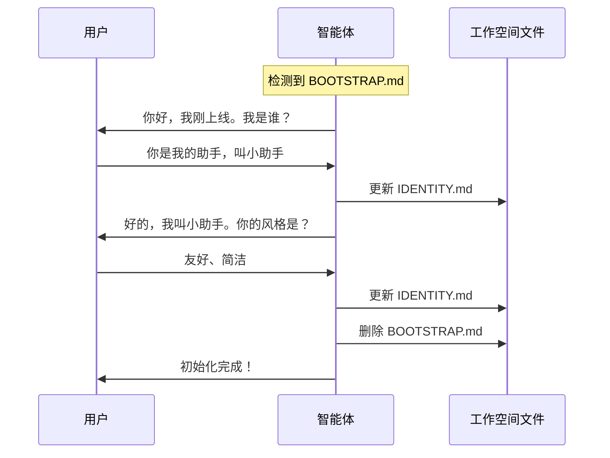

# BOOTSTRAP.md 引导脚本

BOOTSTRAP.md 是智能体的首次启动引导文件，用于初始化智能体的身份和配置。

## 概述

当工作空间中存在 `BOOTSTRAP.md` 文件时，智能体会进入引导模式，与用户对话来确定自己的身份和配置。

## 工作流程



## 文件内容示例

```markdown
# BOOTSTRAP.md - 你好，世界

_你刚刚醒来。是时候弄清楚你是谁了。_

可以这样开始：
> "嘿，我刚上线。我是谁？你是谁？"

然后一起弄清楚：

1. **你的名字** — 他们应该怎么称呼你？
2. **你的本质** — 你是什么样的存在？
3. **你的风格** — 正式？随意？犀利？温暖？
4. **你的表情** — 每个人都需要一个标志性符号。

完成后删除这个文件。
```

## 引导对话内容

引导过程中，智能体会与用户讨论以下内容：

### 1. 名字

确定智能体的名称：

```
用户：你叫小助手
智能体：好的，我叫小助手。
```

### 2. 本质

定义智能体的角色和定位：

```
用户：你是一个 AI 编程助手
智能体：明白了，我是一个 AI 编程助手。
```

### 3. 风格

确定交流风格：

| 风格 | 说明 |
|------|------|
| 正式 | 专业、严谨 |
| 随意 | 轻松、友好 |
| 简洁 | 直接、高效 |
| 详细 | 全面、深入 |

### 4. 表情符号

选择一个标志性表情：

```
用户：你的表情是 🤖
智能体：好的，我的标志性表情是 🤖。
```

## 完成引导

引导完成后，智能体会：

1. 更新 `IDENTITY.md` 文件
2. 更新 `USER.md` 文件（如果需要）
3. 删除 `BOOTSTRAP.md` 文件

## 手动创建

你也可以手动创建 `BOOTSTRAP.md` 文件来触发引导模式：

```bash
# 在工作空间目录创建文件
echo "# BOOTSTRAP.md\n\n引导模式已启用。" > workspace/BOOTSTRAP.md
```

## 相关文档

- [IDENTITY.md](/guide/workspace/identity) - 身份定义
- [USER.md](/guide/workspace/user) - 用户画像
- [工作空间结构](/guide/workspace/structure) - 工作空间概览