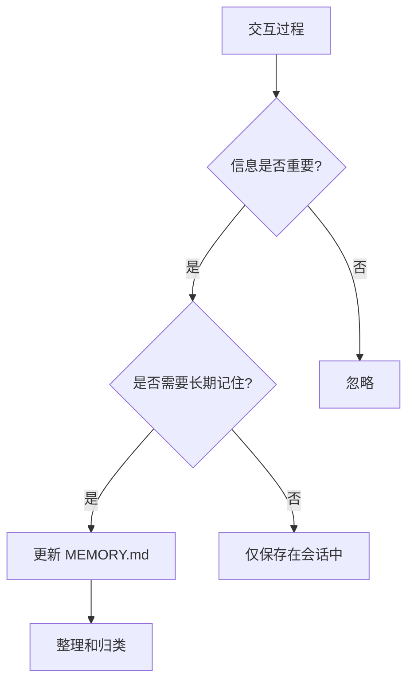

# MEMORY.md 长期记忆

MEMORY.md 存储智能体的长期记忆，包含核心知识和重要信息。

## 概述

MEMORY.md 是智能体的"长期记忆"，存储经过整理和筛选的重要信息。与短期会话记忆不同，长期记忆会持久保存，并在后续会话中持续使用。

## 重要说明

::: warning 安全注意
MEMORY.md **仅在主会话中加载**，不会在群聊中加载。这是出于安全考虑，避免在公共场合泄露私人信息。
:::

## 文件位置

```
workspace/
└── MEMORY.md
```

## 文件内容示例

```markdown
# 长期记忆

## 关于项目

### TPClaw 项目

- 基于 RuleGo 规则引擎的 AI 智能体平台
- 支持多智能体协作
- 支持 IM 通道接入（飞书、钉钉等）
- 仓库地址：https://github.com/teambuf/tpclaw

### 技术架构

- 后端：Go + RuleGo
- 前端：Vue 3 + TypeScript
- 数据库：PostgreSQL（可选）
- 消息队列：内置

## 关于用户

### 张三

- 软件工程师，主要使用 Go 和 Python
- 当前负责 TPClaw 项目的开发
- 偏好简洁直接的沟通风格
- 工作时间：9:00 - 18:00（北京时间）

### 重要约定

- 重要决策需要邮件确认
- 代码变更需要 PR 审核
- 每周五下午进行项目回顾

## 技术知识

### RuleGo 规则引擎

- 规则链由节点和连接组成
- 支持表达式语言：${...}
- 内置节点类型：action, filter, transform

### AI 组件

- 智能体节点类型：ai/agent
- 支持 ReAct 模式
- 工具类型：builtin, agent, rulechain

## 重要联系人和资源

### 团队成员

- 李四：产品经理，负责需求
- 王五：前端开发，负责 UI

### 外部资源

- RuleGo 文档：https://rulego.cc
- 飞书开放平台：https://open.feishu.cn

## 待办事项

- [ ] 完成用户认证模块
- [ ] 优化会话压缩算法
- [ ] 添加更多 IM 通道支持
```

## 记忆分类

### 项目知识

关于项目的技术细节和架构：

- 项目概述
- 技术栈
- 架构设计
- 重要配置

### 用户信息

关于用户的重要信息：

- 用户偏好
- 工作习惯
- 重要约定

### 技术知识

积累的技术经验：

- 框架使用
- 最佳实践
- 常见问题解决

### 联系人和资源

需要记住的联系信息：

- 团队成员
- 外部资源
- 重要链接

## 记忆管理原则

### 应该记录的内容

- ✅ 经常查询的信息
- ✅ 重要的决策和约定
- ✅ 项目关键知识
- ✅ 用户偏好和习惯

### 不应该记录的内容

- ❌ 临时性信息
- ❌ 敏感信息（密码、密钥）
- ❌ 可从其他来源获取的信息
- ❌ 频繁变化的信息

## 记忆更新流程



## 每日笔记

除了 MEMORY.md，还可以使用每日笔记记录临时信息：

```
workspace/
└── memory/
    ├── 2024-01-15.md
    ├── 2024-01-16.md
    └── 2024-01-17.md
```

每日笔记内容：

```markdown
# 2024-01-15

## 今日工作

- 完成了用户认证模块
- 修复了会话压缩的 bug
- 与产品讨论了新功能

## 明日计划

- 开始 IM 通道集成
- 优化性能

## 备注

- 用户提到下周有新需求
```

## 在智能体中引用

MEMORY.md 在系统提示词中条件引用：

```json
{
  "systemPrompt": "${include(global.root_dir+'/workspace/MEMORY.md')}"
}
```

::: tip 提示
MEMORY.md 只在主会话中加载，群聊中不会加载，保护用户隐私。
:::

## 相关文档

- [记忆系统](/guide/core-features/memory) - 记忆机制详解
- [USER.md](/guide/workspace/user) - 用户画像
- [工作空间结构](/guide/workspace/structure) - 工作空间概览